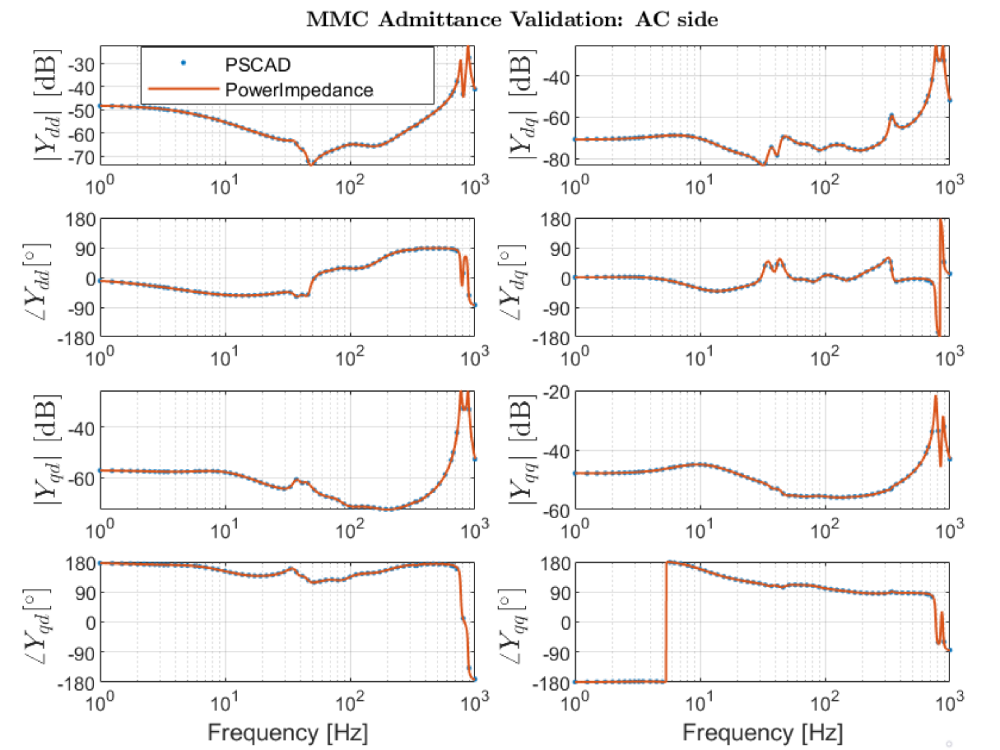

# PowerImpedance

PowerImpedance is a Julia package for frequency-domain analysis of modern power systems. It provides tools for impedance/admittance characterization and fast small-signal stability assessment based on analytical models validated against PSCAD EMT simulations using the Z-tool [1,2]. All implemented models have been validated in the frequency range from 0.1 Hz to 5 kHz.

## Supported Components

### Analytical Models

- Modular Multilevel Converters (MMCs)
  - Grid-Following (GFL) control
  - Grid-Forming (GFM) control
  - Multiple modulation schemes
- Two-level converters with various control strategies
- Overhead transmission lines
- Underground cables
- Synchronous generators
- Induction machines
- Transformers
- Impedances
- Ideal voltage sources

### Black-Box Models

Frequency-response data can be imported for:

- Passive components
- VSC-based AC/DC converters

## Features

### Impedance Characterization

- Impedance/admittance identification of individual components and aggregated systems

### Loop-Gain-Based Stability Assessment

- Stability assessment using the Generalized Nyquist Criterion (GNC)
  - Applicable to standalone-stable Multiple-Input Multiple-Output (MIMO) systems
- Oscillation mode identification using the Phase-Shift Criterion (PSC)

### Nodal-Impedance-Based Stability Assessment

- Eigenvalue decomposition of nodal impedance matrices
- Stability assessment using the Positive Mode Damping (PMD) criterion
- Oscillation mode identification using PMD
- Stability assessment using the Phase-Shift Criterion (PSC)
- Oscillation mode identification using PSC
- Bus participation factor analysis

### Additional Analysis Tools

- Passivity assessment
- Small-gain analysis

## Example

The figure below shows the admittance characteristics of a point-to-point HVDC link consisting of two MMCs. The analytical results are validated against PSCAD EMT simulations.

A step-by-step implementation of this example is available in the `examples` folder.



## Installation

Install the latest release using the Julia package manager:

```julia
] add PowerImpedanceACDC
```

## Citation

If you use PowerImpedance in your research, please cite:

```bibtex
@misc{PowerImpedance25,
  author = {Etch},
  title  = {PowerImpedance: Impedance-Based Stability Analysis},
  month  = mar,
  year   = {2025}
}
```

## Contributors

- **Aleksandra Lekic**
  - Initial implementation
  - MMCs
  - Overhead lines
  - Cables
  - Transformers

- **Özgür Can Sakinci**
  - MMCs
  - Two-level converters
  - Synchronous generators
  - Time-delay models
  - Initial bipolar implementation

- **Thomas Roose**
  - Generalized Nyquist analysis
  - Eigenvalue decomposition
  - Bus participation factors

- **Francisco J. Cifuentes Garcia**
  - Passivity analysis
  - Small-gain analysis
  - Oscillation mode identification
  - Phase-Shift Criterion implementation
  - MMC models
  - Two-level converter models
  - Synchronous machine models

- **Jan Kircheis**
  - MMC models
  - Component validation
  - Multinodal stability analysis
  - Black-box model implementation
  - Transformers

- **Robbe Vander Eeckt**
  - Component validation
  - Two-level converters
  - Power-flow implementation
  - Induction machines
  - Code development

- **Amr Saad**
  - Component validation

- **Amauri Martins**
  - Passive components
  - NetworkBuilder
  - Testing
  - Continuous integration

- **Luis Müller**
  - Bipolar implementation
  - Code development

  
- **Paulin Eliat-Eliat**
  - MMC models
  - Code development


## References

[1] F. J. Cifuentes Garcia et al., "Automated Frequency-Domain Small-Signal Stability Analysis of Electrical Energy Hubs," IEEE PES ISGT Europe, 2024.

[2] Francisco Javier Cifuentes Garcia, Jef Beerten, "Z-Tool: Frequency-domain characterization of EMT models for small-signal stability analysis," Electric Power Systems Research, Volume 252,2026
