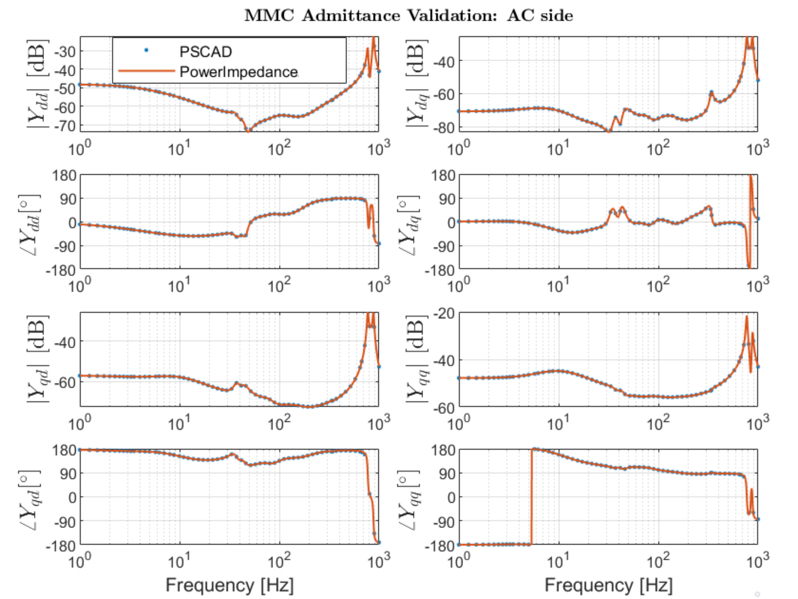

# PowerImpedance.jl

[](https://app.codecov.io/github/Electa-Git/PowerImpedance.jl)
[](https://github.com/JuliaTesting/Aqua.jl)
[](https://electa-git.github.io/PowerImpedance.jl/stable/)
[](https://github.com/Electa-Git/PowerImpedance.jl/actions/workflows/release-ci.yml)
[](LICENSE.md)

PowerImpedance is a Julia package for frequency-domain analysis of modern
AC, DC, and hybrid power systems. It provides impedance and admittance
characterization, AC/DC power-flow initialization, and fast small-signal
stability assessment using analytical models validated against PSCAD EMT
simulations with the [Z-tool](https://github.com/Electa-Git/Z-tool). The
analytical component models have been validated over the frequency range from
0.1 Hz to 5 kHz.

## Supported components

### Analytical models

- Modular multilevel converters (MMCs)
  - Grid-following (GFL) control
  - Grid-forming (GFM) control
  - Multiple modulation schemes
- Two-level converters with multiple control strategies
- Overhead transmission lines
- Underground cables
- Synchronous generators
- Induction machines
- Transformers
- Lumped impedances
- Ideal AC and DC voltage sources

### Black-box models

Frequency-response data can be imported for:

- Passive components
- VSC-based AC/DC converters

## Features

### Impedance characterization

- Driving-point and transfer impedance or admittance characterization of
  individual components and aggregated systems
- Nodal and edge admittance construction

### Loop-gain-based stability assessment

- Stability assessment using the Generalized Nyquist Criterion (GNC) for
  standalone-stable multiple-input multiple-output (MIMO) systems
- Oscillation-mode identification using the Phase-Shift Criterion (PSC)
- Bode plots, stability margins, and unstable-frequency scans

### Nodal-impedance-based stability assessment

- Eigenvalue decomposition of nodal impedance matrices
- Stability assessment and oscillation-mode identification using the Positive
  Mode Damping (PMD) criterion
- Stability assessment and oscillation-mode identification using PSC
- Bus participation-factor analysis

### Additional analysis tools

- Passivity assessment
- Small-gain analysis

### Optional declarative plotting

The backend-independent `PlotBuilder` describes axes, series, layouts,
controls, legends, and SVG settings without loading a graphics package.
Optional CairoMakie, GLMakie, and WGLMakie extensions render harmonic nodal
impedance and completed stability-analysis results. See the
[PlotBuilder guide](docs/src/developers/plotbuilder.md).

### Parametric and uncertainty studies

Gridspace extends the ordinary component constructors to deterministic
parameter sweeps and uncertainty quantification while preserving the scalar
API. Importing `Grid` from `PowerImpedance.NetworkBuilder` and passing it as
the first positional argument selects the lazy NetworkBuilder form. Selected
component parameters can then receive `Grid(...)` values without qualifying
every constructor through the `NetworkBuilder` namespace.

The same composite grammar covers power flow, impedance, nodal admittance,
loop gain, and small-signal stability analysis. `Combinatorial`, `LinearError`,
and `MonteCarlo` return typed results with aligned configuration metadata. Every
PowerModels trial receives a numeric network realization. The package can
reconstruct aggregate bus values as Measurements after the local Monte Carlo
run. See the
[Gridspace guide](docs/src/gridspace.md).

Optional package extensions provide covariance-aware `Measurements` sampling
and construction of overhead lines and cables from phase-domain
`LineParameters` objects produced by
[LineCableModels.jl](https://github.com/Electa-Git/LineCableModels.jl). See
[Package extensions](docs/src/package_extensions.md).

### Explicit network topology and calculations

`NetworkBuilder.define` accepts one row per connected element terminal:

```julia
using PowerImpedance
using PowerImpedance.NetworkBuilder: define

elements = (branch = impedance(z = 2.0, pins = 1),)
connections = (
    (node = :bus, element = :branch, side = 1, terminal = 1),
    (node = :gnd, element = :branch, side = 2, terminal = 1),
)
network = define(elements, connections)
```

`NetworkTopology` derives AC/DC domains and bus indices from component port
definitions while preserving input-row and first-occurrence node order. The
public problem/formulation interface evaluates nodal impedance, node and edge
admittance, loop gain, and downstream stability analyses from either a
`NetworkState` or an already linearized `NetworkModel`. See
[Network construction](docs/src/network.md) and the executable
[Connection DSL tutorial](examples/Connection_DSL.jl).

The Classic network DSL remains available with
`import PowerImpedance: @network`; the macro is no longer imported by
`using PowerImpedance`.

## Example

The figure below shows the admittance characteristics of a point-to-point HVDC
link consisting of two MMCs. The analytical results are validated against
PSCAD EMT simulations. A step-by-step model is available in the
`examples` folder.



## Installation

Install the latest release using the Julia package manager:

```julia
pkg> add PowerImpedance
```

Then load the package:

```julia
using PowerImpedance
```

The Measurements extension activates when `Measurements` is loaded. Direct
deterministic `LineParameters` interoperability activates with
[LineCableModels.jl](https://github.com/Electa-Git/LineCableModels.jl). Loading
both packages adds Measurements-aware line-parameter sampling.

## Citation

If you use PowerImpedance in your research, please cite:

```bibtex
@misc{PowerImpedance25,
  author = {{Etch}},
  title  = {{PowerImpedance}: Impedance-Based Stability Analysis},
  month  = mar,
  year   = {2025}
}
```

## Contributors

- **Aleksandra Lekic**
  - Initial package code
  - MMCs
  - Overhead lines
  - Cables
  - Transformers

- **Özgür Can Sakinci**
  - MMCs
  - Two-level converters
  - Synchronous generators
  - Time-delay models
  - Initial bipolar model

- **Thomas Roose**
  - Generalized Nyquist analysis
  - Eigenvalue decomposition
  - Bus participation factors

- **Francisco J. Cifuentes Garcia**
  - Passivity analysis
  - Small-gain analysis
  - Oscillation-mode identification
  - Phase-Shift Criterion method
  - MMC models
  - Two-level converter models
  - Synchronous machine models

- **Jan Kircheis**
  - MMC models
  - Component validation
  - Multinodal stability analysis
  - Black-box models
  - Transformers

- **Robbe Vander Eeckt**
  - Component validation
  - Two-level converters
  - Power-flow solver integration
  - Induction machines
  - Code development

- **Amr Saad**
  - Component validation

- **Amauri Martins**
  - Passive components
  - NetworkBuilder
  - Testing
  - Continuous integration
  - Parametric studies
  - Uncertainty quantification
  - Extension modules for Measurements and [LineCableModels.jl](https://github.com/Electa-Git/LineCableModels.jl)

- **Luis Müller**
  - Bipolar model
  - Code development

- **Paulin Eliat-Eliat**
  - MMC models
  - Code development

## Development

For local Conventional Commit warnings, enable the tracked advisory hook with:

```bash
git config core.hooksPath .githooks
```

The hook never blocks a commit.

## Acknowledgements

This work is supported by the Etch Competence Hub of EnergyVille, financed by the Flemish Government.

<p align = "left">
  <p><br></p>
  <p></p>
  <p></p>
</p>
