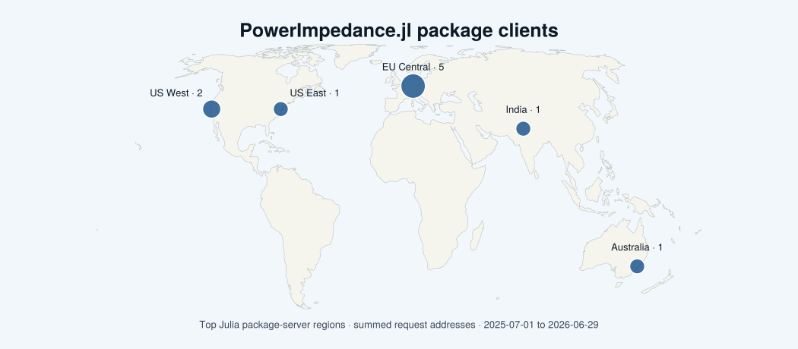

```@meta
CurrentModule = PowerImpedance
```

# PowerImpedance.jl

PowerImpedance is a frequency-domain modelling and small-signal analysis
package for AC, DC, and hybrid power systems. It combines detailed passive and
active component models with multiport network assembly, AC/DC power-flow
initialization, impedance extraction, and stability-analysis tools.

## Capabilities

The package provides analytical models for:

- AC and DC voltage sources;
- lumped impedances and transformers;
- overhead lines and underground cables;
- modular multilevel and two-level converters;
- synchronous and induction machines; and
- black-box passive and converter frequency responses.

Driving-point and transfer impedances describe the resulting systems. Nodal and
edge admittances support generalized Nyquist, Bode, passivity, small-gain,
stability-margin, unstable-frequency, and eigenvalue analyses.

Gridspace extends the same physical constructors to deterministic parameter
sweeps and uncertainty quantification. It preserves the ordinary scalar API,
samples each uncertain network into ordinary numeric components, and performs
the required power flow and linearization for every materialized configuration.

## Installation

Install the package from the Julia package manager:

```julia
pkg> add PowerImpedance
```

Then load it with:

```julia
using PowerImpedance
```

Optional interoperability is activated by loading `Measurements` or
`LineCableModels` in the same environment. See [Package extensions](package_extensions.md)
for the supported combinations and data structures.

## Where to start

- [Introduction](introduction.md) explains the multiport ABCD representation
  and impedance-based stability workflow.
- [Network construction](network.md) covers the scalar and declarative
  NetworkBuilder interfaces.
- [Power-flow initialization](initialization.md) explains when operating
  points are computed or reused.
- [Impedance and stability analysis](results.md) introduces the downstream
  analysis tools and result forms.
- [Parametric and uncertainty studies](gridspace.md) documents deterministic
  grids, Monte Carlo studies, retained samples, and statistics.
- [Examples](examples/index.md) contains executable Literate tutorials.
- [API reference](reference.md) lists the public interfaces by module.

The theoretical background retained from the original package documentation
is cited through the project [bibliography](bibliography.md).

## User statistics



The map is generated in CI from Julia's public package-server request logs. It shows the top server regions by the sum of `request_addrs` for requests marked as user traffic. These regional aggregates are useful adoption indicators, but they are not a count of distinct people and must not be read as country-level telemetry.
