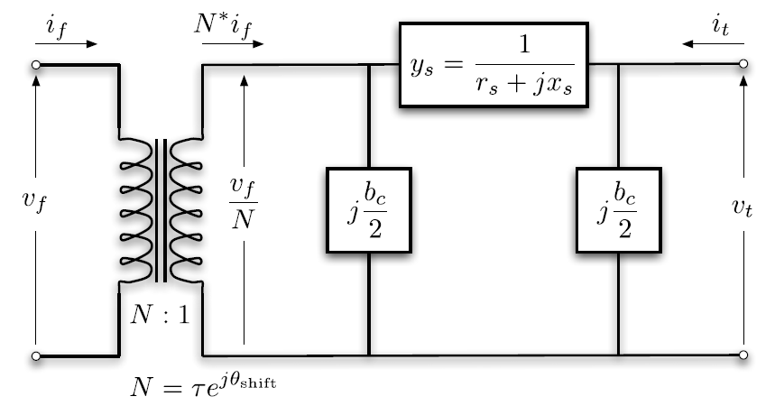
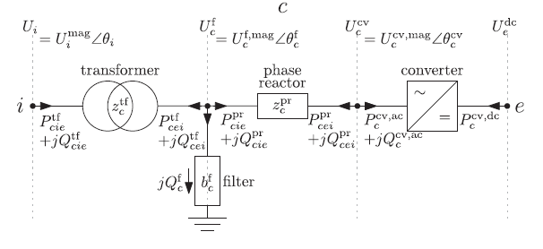

```@meta
CurrentModule = PowerImpedance
```

# Power-flow initialization

Frequency-domain converter and machine models are linearized around a
steady-state operating point. PowerImpedance obtains that operating point
from the combined AC/DC power-flow model and then applies the solved setpoints
to the detailed active-device models.

The package maps the constructed network to PowerModels and PowerModelsACDC
data structures. Those formulations build on the MATPOWER and MatACDC network
models [Ergun2019, Beerten2012, ZimmermanMurillo2020](@cite).

## Branch equivalents

Balanced AC branches use the standard ``\pi`` equivalent. With series
admittance ``y_s``, shunt conductance ``g_c``, shunt susceptance ``b_c``, tap
ratio ``\tau``, and phase shift ``\theta_{\mathrm{shift}}``, the branch
admittance is

```math
\mathbf{Y}_{ac} =
\begin{bmatrix}
\left(y_s+\frac{g_c}{2}+\mathrm{j}\frac{b_c}{2}\right)\tau^{-2} &
-\dfrac{y_s}{\tau\exp(-\mathrm{j}\theta_{\mathrm{shift}})} \\
-\dfrac{y_s}{\tau\exp(-\mathrm{j}\theta_{\mathrm{shift}})} &
y_s+\dfrac{g_c}{2}+\mathrm{j}\dfrac{b_c}{2}
\end{bmatrix}.
```



Detailed impedance, transformer, overhead-line, and cable objects are reduced
to the equivalent branch quantities required at the fundamental frequency.
Their full frequency-dependent models remain available to the later impedance
and small-signal calculations.

## Converter equivalents

A power-flow converter contains its AC and DC terminals, series reactor, loss
model, and control mode. Depending on its setpoints, it regulates DC voltage or
active power together with its selected AC-side quantity.



Once power flow is solved, the operating point is used for the nonlinear
equilibrium and active-device linearization. Power-flow warnings therefore
refer to the sampled physical converter and its constraints, not to an
aggregated uncertain model.

## Calculated operating point

`compute(PowerFlowProblem(network), ACDCPowerFlow())` returns a typed `PowerFlowResult`. Its `result`, `data`, `nodes2bus`, and `elem2comp` fields retain the PowerModelsACDC calculation and conversion mappings. The `operating_point` field contains the per-element `Setpoint` values required by active-component linearization. `active_setpoint_values` provides the corresponding dictionary.

`compute(LinearizationProblem(network, powerflow), AdmittanceLinearization())` consumes that exact result and returns a `LinearizationResult`. Its `network_model` field contains the calculated frequency-domain `NetworkModel`. Its `operating_point` field records the point used to build the active admittances. The package root and `NetworkBuilder` re-export the same problem and formulation types.

Linear networks skip the power-flow solve and use an empty `OperatingPoint`.
`solve(network_state)` constructs its Classic `Network` result from the same
`PowerFlowResult`. It does not perform a second power flow.

## Reuse in parametric studies

Every materialized network configuration performs its own required power flow before linearization. Passive parameters can change the power-flow solution and the active-device setpoints, so their classification does not authorize reuse.

An explicit `preprocess` call may pair completed parametric `PowerFlowResult` values with their originating network configurations. This path reuses only those exact results. There is no implicit operating-point cache or nominal-network substitution.

Each Monte Carlo trial samples a complete numeric network before calling JuMP or PowerModelsACDC. The aggregate reconstructs supported bus-level `Measurement` values from the completed numeric solves.
