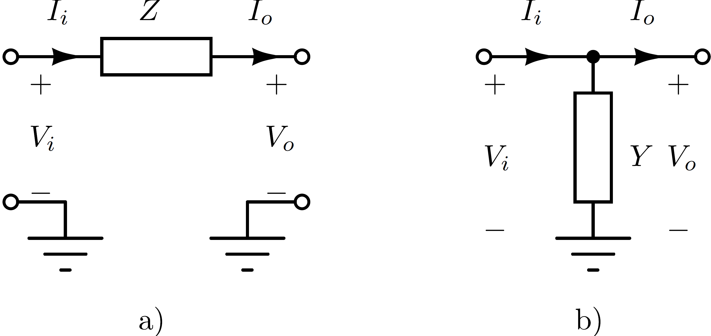
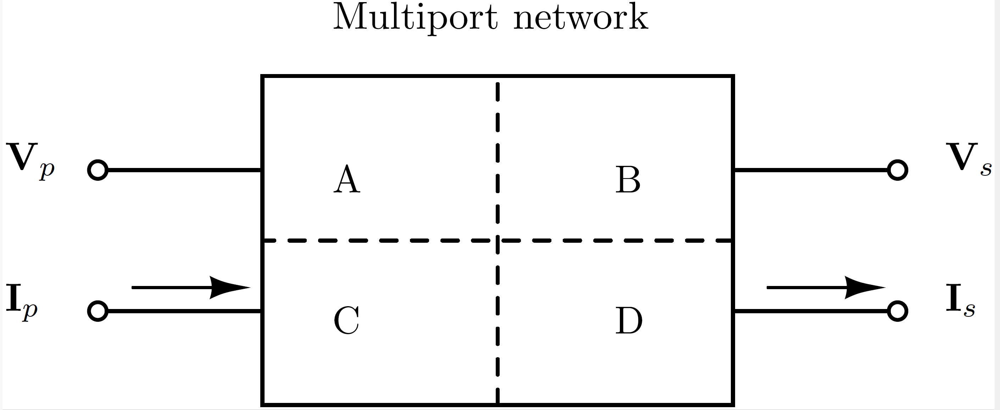
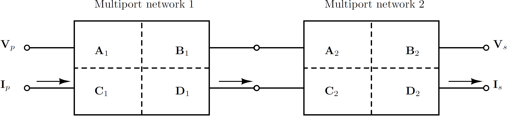
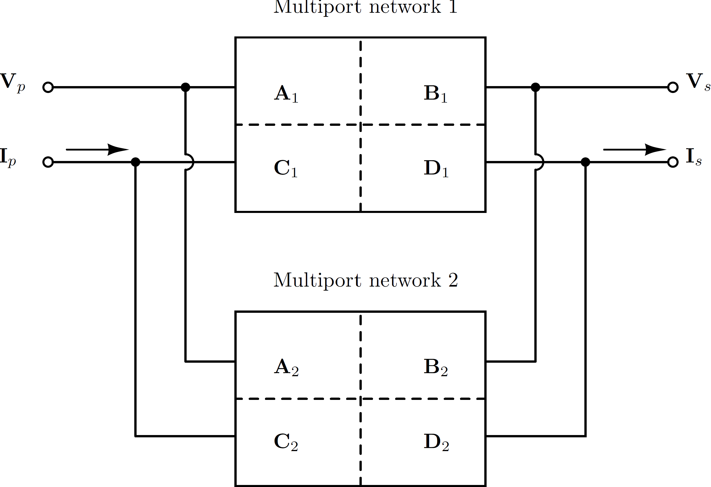

# Introduction

Power-electronic converters interact with passive networks and with other
controlled devices over a broad frequency range. These interactions are often
described as harmonic or electromagnetic stability phenomena. Frequency-domain
small-signal models make those interactions visible without requiring a full
electromagnetic-transient simulation for every operating condition
[WangBlaabjerg2019, BayoSalas2018](@cite).

PowerImpedance builds linearized multiport models around an AC/DC
power-flow operating point. Detailed passive models retain their
frequency-dependent behavior, while active components include the relevant
electrical dynamics and controls. The assembled response can then be used for
impedance-based or nodal-admittance-based stability assessment
[Middlebrook1978, Harnefors2007](@cite).

## Why multiport ABCD parameters?

Some elementary interconnections do not admit a finite impedance or admittance
description. An ideal series branch has no finite open-circuit impedance
matrix, while an ideal shunt connection has no finite short-circuit admittance
matrix. The two cases are illustrated below.



ABCD parameters instead relate the input-port variables directly to the
output-port variables. For an ``n``-port system,

```math
\begin{bmatrix}
\mathbf{V}_p \\
\mathbf{I}_p
\end{bmatrix}
=
\begin{bmatrix}
\mathbf{A} & \mathbf{B} \\
\mathbf{C} & \mathbf{D}
\end{bmatrix}
\begin{bmatrix}
\mathbf{V}_s \\
\mathbf{I}_s
\end{bmatrix},
```

where each block is ``n\times n``. A port may represent a single conductor, a
polyphase AC terminal, a multipole DC terminal, or the boundary of a larger
subnetwork.



## Interconnecting multiports

Series-connected components compose by multiplying their ABCD matrices in
physical order:

```math
\mathbf{T}_{\mathrm{series}} = \mathbf{T}_1\mathbf{T}_2,
\qquad
\mathbf{T}_k =
\begin{bmatrix}
\mathbf{A}_k & \mathbf{B}_k \\
\mathbf{C}_k & \mathbf{D}_k
\end{bmatrix}.
```



Parallel composition is formed by imposing common terminal voltages and
summing terminal currents. The implementation handles the corresponding block
matrix operations, including cases in which a direct ``\mathbf{B}^{-1}``
formula is unavailable.



ABCD representations are converted to nodal admittance form where required.
For invertible ``\mathbf{B}``, the conversion is

```math
\mathbf{Y} =
\begin{bmatrix}
\mathbf{D}\mathbf{B}^{-1} &
\mathbf{C}-\mathbf{D}\mathbf{B}^{-1}\mathbf{A} \\
-\mathbf{B}^{-1} & \mathbf{B}^{-1}\mathbf{A}
\end{bmatrix}.
```

Nodal impedances can then be recovered from the assembled admittance matrix,
with Kron reduction used to eliminate internal nodes when needed
[Xu2005, DorflerBullo2013](@cite).

## Analysis workflow

The complete workflow is:

1. construct and connect the physical components;
2. solve the AC/DC power flow when nonlinear operating points are required;
3. linearize active devices and assemble frequency-dependent passive models;
4. construct the desired impedance, nodal admittance, edge admittance, or loop
   gain; and
5. apply the relevant stability or sensitivity analysis.

The scalar workflow and Gridspace workflow use the same component and solver
kernels. A deterministic or uncertain study changes orchestration and result
aggregation, not the physical definition of the system.
