# Fundamental concepts

> This page reproduces the fundamental theory described in the historical
> *Electromagnetic Stability Simulator — Developing Guide* of March 17, 2020,
> authored by the package's founding development team: Aleksandra Lekić and
> Philippe De Rua, under the supervision of prof. Dr. Jef Beerten. The presentation has been reorganized for
> the current documentation, while the theoretical content and original figures are
> retained. [Read or download the original manual](Simulator_tutorial.pdf).

PowerImpedance represents passive and active AC/DC components in the frequency
domain and combines them into network models for impedance characterization and
small-signal stability assessment. The central ideas are multiport representations,
coordinate transformations, frequency-dependent component models, and linearization
around a power-flow operating point.

## Why impedance-based analysis

Power-electronic converters introduce controlled dynamics over a much wider frequency
range than conventional electromechanical stability models. Their controllers can interact
with one another and with the surrounding passive network, producing phenomena commonly
described as harmonic or electromagnetic stability problems
[WangBlaabjerg2014, KundurBaluLauby1994, BayoSalas2018](@cite). Protection and control
design for HVDC systems provide the broader system context
[Sood2006, Padiyar1990](@cite).

These interactions can be studied in the Laplace or frequency domain through state-space,
impedance, or admittance representations [WangBlaabjerg2019](@cite). The impedance-based
approach extends Middlebrook's input-filter criterion to interconnected power-system models
[Middlebrook1978](@cite) and has been developed for controlled VSC and MMC systems,
including multiterminal HVDC networks
[JiTangYangLiLiu2019, AgbemukoDominguezGarciaPrietoAraujoGomisBellmunt2019,
LyuZhangCaiMolinas2019, Harnefors2007](@cite).

Useful screening requires frequency-dependent passive models together with the linearized
dynamics of converter controls. The framework therefore combines detailed lines, cables,
transformers, sources, and converter models into one multiport network representation rather
than treating passive harmonic scans and converter dynamics separately.

## Multiport ABCD representation

Classical circuit theory applied to power systems relies on the description of the system using admittance matrices or hybrid matrices [KundurBaluLauby1994, Milano2010](@cite). Commonly, the circuit equations are solved using admittance/hybrid matrices applying Kirchhoff's laws and Ohm's law relying on the Modified Nodal Analysis (MNA) approach for the components described using linear models.

The admittance based representation is also gaining popularity for the assessment of harmonic stability in systems with power electronic components [StamatiouBezaBongiornoHarnefors2017, BessegatoHarneforsIlvesNorrga2019](@cite).

Some valid component configurations have neither finite impedance parameters nor finite admittance parameters. Figure 1a shows a series branch with open input and output ports. The open circuit prevents a finite impedance representation. Figure 1b shows a shunt connection whose shorted ports imply infinite interconnection admittance. A hybrid representation could describe either case, but it makes input and output impedance extraction difficult.

**Figure 1:** Examples of the circuit in which is not defined: a) impedance matrix; b) admittance matrix.

To overcome the challenge of nonexistent  $Z$  or  $Y$  parameter representations, the
framework represents the power system and its constituent components using multiport ABCD
parameters instead (Fig. 2). Multiport networks can include polyphase AC networks,
multi-pole DC networks, and mixed AC/DC subnetworks. ABCD parameters directly relate the
voltages and currents at the input ports to those at the output ports.

**Figure 2:** Polyphase power system using multiport ABCD parameters.

Admittance-based network models are widely used to assess harmonic stability in converter-dominated systems [LiuXieLiu2018](@cite), including voltage-source-converter high-voltage direct-current (VSC HVDC) systems [BayoSalas2018, JiTangYangLiLiu2019](@cite). ABCD-based network construction has received less attention. Bayo Salas used it to model high-frequency interactions in small networks [BayoSalas2018](@cite). Sun et al. studied interactions within converter-control bandwidths of several hundred hertz [SunWuWangDeJongBlaabjergCukCobben2018](@cite), building on the frequency-dependent overhead-line equivalent in [Wu2014](@cite).

This representation allows an equivalent impedance to be constructed at an arbitrary network
node while retaining both active and passive component dynamics. The following sections
derive the common network operations and the component models used to assemble that
equivalent.

### ABCD parameters basics

The system is represented as an interconnection of components. To simplify the calculation of the transfer functions and/or input and output impedances, each component is modeled as a multiport network as depicted in Fig. 2. The input voltages and currents are vectors denoted as  $\mathbf{V}_p$  and  $\mathbf{I}_p$ , while the output voltages and currents are  $\mathbf{V}_s$  and  $\mathbf{I}_s$ . Generally, a multiport network has the same number of input and output ports, and thus, the dimensions of the vectors are the same, denoted as  $n$ .

A multiport network can be represented with ABCD parameters, where each of parameters  $\mathbf{A}$ ,  $\mathbf{B}$ ,  $\mathbf{C}$  and  $\mathbf{D}$  represent  $n \times n$  matrices and

$$\begin{bmatrix} \mathbf{V}_p \\ \mathbf{I}_p \end{bmatrix} = \begin{bmatrix} \mathbf{A} & \mathbf{B} \\ \mathbf{C} & \mathbf{D} \end{bmatrix} \times \begin{bmatrix} \mathbf{V}_s \\ \mathbf{I}_s \end{bmatrix}.$$

As with components in an electrical power systems, their multiport ABCD parameter representations can be interconnected. Two possible connections are series and parallel connections.

- The series connection of two multiport networks is depicted in Fig. 3. The ABCD multiport representation is especially desirable for this type of connection because the new parameters are determined in a simple matter as follows.

$$\begin{bmatrix} \mathbf{V}_p \\ \mathbf{I}_p \end{bmatrix} = \underbrace{\begin{bmatrix} \mathbf{A}_1 & \mathbf{B}_1 \\ \mathbf{C}_1 & \mathbf{D}_1 \end{bmatrix} \times \begin{bmatrix} \mathbf{A}_2 & \mathbf{B}_2 \\ \mathbf{C}_2 & \mathbf{D}_2 \end{bmatrix}}_{\begin{bmatrix} \mathbf{A} & \mathbf{B} \\ \mathbf{C} & \mathbf{D} \end{bmatrix}} \times \begin{bmatrix} \mathbf{V}_s \\ \mathbf{I}_s \end{bmatrix}$$

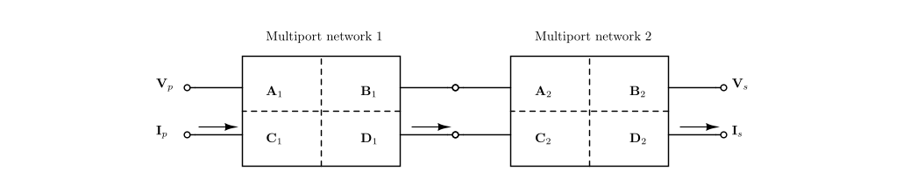

**Figure 3:** Series connected multiport networks.

- The parallel connection, depicted in Fig. 4, is more complex to calculate. In the case of nonzero matrices  $\mathbf{B}_1$  and  $\mathbf{B}_2$ , the parallel connection is represented as:

$$\begin{bmatrix} \mathbf{V}_p \\ \mathbf{I}_p \end{bmatrix} = \underbrace{\begin{bmatrix} (\mathbf{B}_1^{-1} + \mathbf{B}_2^{-1})^{-1} (\mathbf{B}_1^{-1} \mathbf{A}_1 + \mathbf{B}_2^{-1} \mathbf{A}_2) & (\mathbf{B}_1^{-1} + \mathbf{B}_2^{-1})^{-1} \\ \mathbf{C}_1 + \mathbf{C}_2 + (\mathbf{D}_2 - \mathbf{D}_1) (\mathbf{B}_1 + \mathbf{B}_2)^{-1} (\mathbf{A}_1 - \mathbf{A}_2) & \mathbf{D}_1 + (\mathbf{D}_2 - \mathbf{D}_1) (\mathbf{B}_1 + \mathbf{B}_2)^{-1} \mathbf{B}_1 \end{bmatrix}}_{\begin{bmatrix} \mathbf{A} & \mathbf{B} \\ \mathbf{C} & \mathbf{D} \end{bmatrix}} \times \begin{bmatrix} \mathbf{V}_s \\ \mathbf{I}_s \end{bmatrix}.$$

The formula is also valid for networks whose matrices are of dimension  $1 \times 1$ , i.e. two-port networks. If some of the matrices cannot be inverted, the previous equation becomes:

$$\begin{bmatrix} \mathbf{V}_p \\ \mathbf{I}_p \end{bmatrix} = \underbrace{\begin{bmatrix} \mathbf{A}_i & \mathbf{0} \\ \mathbf{C}_1 + \mathbf{C}_2 + (\mathbf{D}_2 - \mathbf{D}_1) \mathbf{B}_j^{-1} (\mathbf{A}_1 - \mathbf{A}_2) & \mathbf{D}_i \end{bmatrix}}_{\begin{bmatrix} \mathbf{A} & \mathbf{B} \\ \mathbf{C} & \mathbf{D} \end{bmatrix}} \times \begin{bmatrix} \mathbf{V}_s \\ \mathbf{I}_s \end{bmatrix},$$

where  $i, j \in \{1, 2\}$  and  $i$  denotes the invertible matrix  $\mathbf{B}_i$  with  $j \neq i$ .

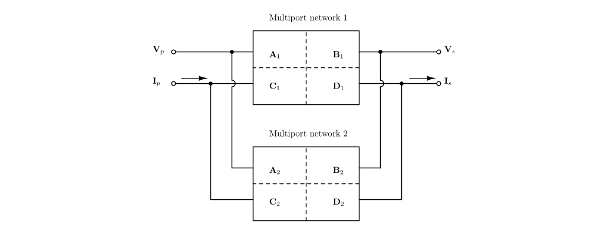

**Figure 4:** Parallel connected multiport networks.

The term ‘multiport network’ includes both an individual component with one or more input and output ports and a subnetwork with defined input and output ports or nodes.

### Determining the input/output impedance of the network

Let us assume that every output port, represented with the voltage  $V_{si}$  and the current  $I_{si}$ , is closed with an impedance  $Z_{ti}$ . Then we can write  $V_{si} = Z_{ti} I_{si}$ , or in matrix form:

$$\mathbf{V}_s = \mathbf{Z}_t \odot \mathbf{I}_s = \tilde{\mathbf{Z}}_t \times \mathbf{I}_s,$$

with  $\odot$  denoting the Hadamard product,  $\mathbf{Z}_t$  the corresponding closing impedance column vector, and  $\tilde{\mathbf{Z}}_t = \text{diag}\{\mathbf{Z}_t\}$  (see Fig. 5).

The input impedance can be then rewritten from:

$$\begin{bmatrix} \mathbf{V}_p \\ \mathbf{I}_p \end{bmatrix} = \begin{bmatrix} \mathbf{A} & \mathbf{B} \\ \mathbf{C} & \mathbf{D} \end{bmatrix} \times \begin{bmatrix} \tilde{\mathbf{Z}}_t \times \mathbf{I}_s \\ \mathbf{I}_s \end{bmatrix},$$

as

$$\mathbf{Z}_p = (\mathbf{A} \times \tilde{\mathbf{Z}}_t + \mathbf{B}) \times (\mathbf{C} \times \tilde{\mathbf{Z}}_t + \mathbf{D})^{-1}.$$

Similarly, by closing the input ports with a diagonal impedance  $\tilde{\mathbf{Z}}_t$ , the impedance as seen from the output ports can be estimated as:

$$\mathbf{Z}_s = (\tilde{\mathbf{Z}}_t \times \mathbf{C} - \mathbf{A})^{-1} \times (\tilde{\mathbf{Z}}_t \times \mathbf{D} - \mathbf{B}).$$

**Figure 5:** Closing impedance on the output side.

### Determination of the combined system ABCD parameters

The ABCD parameters can be used to determine the impedance “visible” from the desired node or a component port. The power system may use different port orders: for example, three ports for a three-phase AC representation, two for a positive-sequence or bipolar DC representation, and one for a monopolar DC representation. To determine the impedance visible from selected nodes, a subsystem is formed recursively from the components and nodes on the paths between them. The example in Fig. 6 has two input and two output ports, represented by $V_{p1,s}$, $V_{p2,s}$, $V_{s1,s}$, and $V_{s2,s}$.

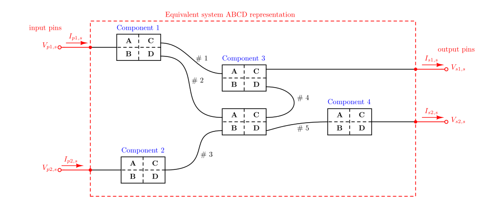

**Figure 6:** Model of the polyphase subsystem.

As can be seen from Fig. 6, the subsystem between input and output nodes contains  $m$  components, where each component  $j \in \{1, \dots, m\}$  is represented with  $p_i^j$  inputs and  $p_o^j$  outputs. The subsystem also contains a total number of  $n_n$  nodes, of which  $n_o$  nodes are output nodes (denoted as  $V_{s1,s}$  and  $V_{s2,s}$  in Fig. 6) or ground nodes. Subsystem has  $n_c$  input currents/voltages (denoted as  $I_{p1,s}$  and  $I_{p2,s}$  in Fig. 6).

Let us assume the following naming convention. The $i$th component has input voltages and currents denoted as $\mathbf{V}_{pi}$ and $\mathbf{I}_{pi}$ (positive currents enter the component and exit the node), and output voltages and currents $\mathbf{V}_{si}$ and $\mathbf{I}_{si}$ (positive currents exit the component and enter the node). $\mathbf{I}_i$ are the subsystem currents entering through the input nodes, and $\mathbf{I}_0$ are the currents entering through ground and the output ports.

The resulting system contains the following groups of equations:

- **Node-balance equations:** there are $n_n$ equations, one for each node in the
  network, expressing the sum of currents entering and leaving that node. By
  convention, a current is positive when it leaves the node.

- **Component voltage equations:** there are
  $\sum_{i=1}^m p_p^i$ equations relating the input voltages
  $\mathbf{V}_{pi}$ to the output voltages $\mathbf{V}_{si}$ and currents
  $\mathbf{I}_{si}$.

- **Component current equations:** there are
  $\sum_{i=1}^m p_p^i$ equations relating the input currents
  $\mathbf{I}_{pi}$ to the output voltages $\mathbf{V}_{si}$ and currents
  $\mathbf{I}_{si}$.

The unknown variables are  $n_v = n_n - n_o$  node voltages,  $n_c$  input currents denoted as  $\mathbf{I}_i$  and  $\sum_{i=1}^m p_p^i + p_s^i$  component currents  $\mathbf{I}_{pi}$  and  $\mathbf{I}_{si}$ .

The complete set of equations is written in a matrix form and consists of  $n_n + \sum_{i=1}^m 2p_p^i$  equations with  $n_v + n_c + \sum_{i=1}^m (p_p^i + p_s^i)$  variables and matrix of outputs with the size  $\left(n_n + \sum_{i=1}^m 2p_p^i\right) \times 2n_o$ . It is:

$$\mathbf{M} \times \mathbf{X} = \mathbf{N} \times \mathbf{Y}$$

where the matrices  $\mathbf{M}$  and  $\mathbf{N}$  consist of numerical and symbolic coefficients, vector  $\mathbf{X} = [V_1 \cdots V_{n_v} \ I_{i1} \cdots I_{in_c} \ \mathbf{I}_{p1} \ \mathbf{I}_{s1} \cdots \mathbf{I}_{pm} \ \mathbf{I}_{sm}]$  consists of the unknown variables and vector  $\mathbf{Y} = [\mathbf{V}_{0j}, \mathbf{I}_{0j}]^T \Big|_{j=1}^{n_o}$  of the output and ground voltages and currents. The system is solved from the reduced row-echelon form of the concatenated matrices  $[\mathbf{M}, \mathbf{N}]$ .

### Transformation from abc to dqz coordinates

The complete AC power system is modeled in *dqz*-frame to fit the developed power converter model. For that purpose, it was necessary to apply *abc* to *dqz* transformation.

In order to transform three-phase voltages and currents from the stationary *abc*-frame to the rotating *dqz*-frame, Park's transformation defined as

$$\mathbf{P}_{\omega_0}(t) = \frac{2}{3} \begin{bmatrix} \cos(\omega_0 t) & \cos\left(\omega_0 t - \frac{2\pi}{3}\right) & \cos\left(\omega_0 t - \frac{4\pi}{3}\right) \\ \sin(\omega_0 t) & \sin\left(\omega_0 t - \frac{2\pi}{3}\right) & \sin\left(\omega_0 t - \frac{4\pi}{3}\right) \\ \frac{1}{2} & \frac{1}{2} & \frac{1}{2} \end{bmatrix},$$

is employed. The inverse Park's transformation is given as

$$\mathbf{P}_{\omega_0}^{-1}(t) = \frac{3}{2} \mathbf{P}_{\omega_0}^T(t) + \frac{1}{2} \begin{bmatrix} 0 & 0 & 1 \\ 0 & 0 & 1 \\ 0 & 0 & 1 \end{bmatrix}.$$

For the transformation of the admittance from the *abc*- to the *dqz*-frame, the following theorem can be formulated.

There has been reported work [LevronBelikov2017](@cite) that applies the transformation formula only for symmetrical systems. The formula is also successfully applied for modeling overhead lines in the *dq*-frame in [BelikovLevron2018, DArcoSuulBeerten2019](@cite).

The following theorem presents derivation of the transformation from *abc*-frame to *dq*-frame for the only one admittance  $3 \times 3$ . In the case of the multiport parameters representation the same formula can be used for the each of four  $3 \times 3$  submatrices giving interconnections between inputs and outputs.

**Theorem 1.** Every $3 \times 3$ admittance in the *abc*-domain
$\mathbf{Y}(j\omega)$ can be transformed to the *dq*-domain without loss of
generality as

$$\mathbf{Y}_{dq}(j\omega) =
\frac{1}{3}
\left.
\left\{
    \mathbf{a}\mathbf{Y}\!\left[j(\omega + \omega_0)\right]
    + \bar{\mathbf{a}}\mathbf{Y}\!\left[j(\omega - \omega_0)\right]
\right\}
\Re\{\mathbf{a}\}^{T}
\right|_{dq},$$

where $\mathbf{a}$ is a transformation matrix defined as

$$\mathbf{a} = \begin{bmatrix} 1 & \exp(j\varphi) & \exp(2j\varphi) \\ j & j \exp(j\varphi) & j \exp(2j\varphi) \\ 0 & 0 & 0 \end{bmatrix},$$

for  $\varphi = \frac{2\pi}{3}$ .

*Proof.* Currents and voltages in the *dqz*-frame are related to the currents and voltages in the *abc*-frame as:

$$\begin{aligned} \mathbf{i}_{dqz}(t) &= \mathbf{P}_{\omega_0}(t) \mathbf{i}_{abc}(t), \\ \mathbf{v}_{dqz}(t) &= \mathbf{P}_{\omega_0}(t) \mathbf{v}_{abc}(t), \end{aligned}$$

and vice versa, *abc* quantities can be transformed to their *dqz* equivalents as:

$$\begin{aligned} \mathbf{i}_{abc}(t) &= \mathbf{P}_{\omega_0}^{-1}(t) \mathbf{i}_{dqz}(t), \\ \mathbf{v}_{abc}(t) &= \mathbf{P}_{\omega_0}^{-1}(t) \mathbf{v}_{dqz}(t), \end{aligned}$$

with  $\omega_0$  being the angular frequency of the rotating frame. Multiplication in the
time domain becomes convolution in the spectral domain under the Fourier transform.

In the spectral domain, the relation between the currents and voltages in the *abc*-frame can be written as:

$$\mathbf{I}_{abc}(j\omega) = \mathbf{Y}(j\omega) \mathbf{V}_{abc}(j\omega).$$

This equation can be further used as:

$$\begin{aligned}
\mathbf{I}_{dqz}(j\omega)
    &= \frac{1}{2\pi}\mathbf{P}_{\omega_0}(j\omega)
       * \left[\mathbf{Y}(j\omega)\mathbf{V}_{abc}(j\omega)\right] \\
    &= \frac{1}{2\pi}\mathbf{P}_{\omega_0}(j\omega)
       * \left\{
           \mathbf{Y}(j\omega)\frac{1}{2\pi}
           \mathbf{P}_{\omega_0}^{-1}(j\omega)
           * \mathbf{V}_{dqz}(j\omega)
       \right\}.
\end{aligned}$$

where the Fourier transform applied to Park's transform gives:

$$\mathbf{P}_{\omega_0}(j\omega) = \frac{2\pi}{3}
\left[
    \mathbf{a}\delta(\omega + \omega_0)
    + \bar{\mathbf{a}}\delta(\omega - \omega_0)
    + \mathbf{c}\delta(\omega)
\right],$$

where  $\bar{\mathbf{a}}$  denotes conjugate of the matrix  $\mathbf{a}$  and

$$\begin{aligned} \mathbf{a} &= \begin{bmatrix} 1 & \exp(j\varphi) & \exp(2j\varphi) \\ j & j \exp(j\varphi) & j \exp(2j\varphi) \\ 0 & 0 & 0 \end{bmatrix}, \\ \mathbf{c} &= \begin{bmatrix} 0 & 0 & 0 \\ 0 & 0 & 0 \\ 1 & 1 & 1 \end{bmatrix}, \end{aligned}$$

for  $\varphi = \frac{2\pi}{3}$ . Similarly, the Fourier transform applied to the inverse Park's transform is given by:

$$\mathbf{P}_{\omega_0}^{-1}(j\omega) = \pi
\left[
    \mathbf{a}^{T}\delta(\omega + \omega_0)
    + \bar{\mathbf{a}}^{T}\delta(\omega - \omega_0)
    + 2\mathbf{c}^{T}\delta(\omega)
\right]$$

To keep the sideband expressions readable, for any response $\mathbf{X}$ below,
define

$$\mathbf{X}_k \equiv \mathbf{X}\!\left[j(\omega + k\omega_0)\right],
\qquad k \in \mathbb{Z}.$$

Denoting

$$\mathbf{G}_0 = \frac{1}{2\pi}
\mathbf{P}_{\omega_0}^{-1}(j\omega) * \mathbf{V}_{dqz,0},$$

one obtains

$$\begin{aligned}
\mathbf{G}_0
    &= \frac{1}{2}
       \left[
           \mathbf{a}^{T}\delta(\omega + \omega_0)
           + \bar{\mathbf{a}}^{T}\delta(\omega - \omega_0)
           + 2\mathbf{c}^{T}\delta(\omega)
       \right] * \mathbf{V}_{dqz,0} \\
    &= \frac{1}{2}
       \left[
           \mathbf{a}^{T}\mathbf{V}_{dqz,+1}
           + \bar{\mathbf{a}}^{T}\mathbf{V}_{dqz,-1}
           + 2\mathbf{c}^{T}\mathbf{V}_{dqz,0}
       \right].
\end{aligned}$$

Similarly, with $\mathbf{H}_k = \mathbf{Y}_k\mathbf{G}_k$, one can write

$$\begin{aligned}
\mathbf{I}_{dqz}(j\omega)
    &= \frac{1}{3}
       \left[
           \mathbf{a}\delta(\omega + \omega_0)
           + \bar{\mathbf{a}}\delta(\omega - \omega_0)
           + \mathbf{c}\delta(\omega)
       \right] * \mathbf{H}_0 \\
    &= \frac{1}{3}
       \left[
           \mathbf{a}\mathbf{H}_{+1}
           + \bar{\mathbf{a}}\mathbf{H}_{-1}
           + \mathbf{c}\mathbf{H}_0
       \right] \\
    &= \frac{1}{3}
       \left[
           \mathbf{a}\mathbf{Y}_{+1}\mathbf{G}_{+1}
           + \bar{\mathbf{a}}\mathbf{Y}_{-1}\mathbf{G}_{-1}
           + \mathbf{c}\mathbf{Y}_0\mathbf{G}_0
       \right] \\
    &= \frac{1}{6}
       \left\{
           \mathbf{a}\mathbf{Y}_{+1}
           \left[
               \mathbf{a}^{T}\mathbf{V}_{dqz,+2}
               + \bar{\mathbf{a}}^{T}\mathbf{V}_{dqz,0}
               + 2\mathbf{c}^{T}\mathbf{V}_{dqz,+1}
           \right]
           + \bar{\mathbf{a}}\mathbf{Y}_{-1}
           \left[
               \mathbf{a}^{T}\mathbf{V}_{dqz,0}
               + \bar{\mathbf{a}}^{T}\mathbf{V}_{dqz,-2}
               + 2\mathbf{c}^{T}\mathbf{V}_{dqz,-1}
           \right]
           + \mathbf{c}\mathbf{Y}_0
           \left[
               \mathbf{a}^{T}\mathbf{V}_{dqz,+1}
               + \bar{\mathbf{a}}^{T}\mathbf{V}_{dqz,-1}
               + 2\mathbf{c}^{T}\mathbf{V}_{dqz,0}
           \right]
       \right\}.
\end{aligned}$$

Since only the $d$- and $q$-components are retained, the terms involving the
zero component vanish under projection:

$$\begin{aligned}
\left.\mathbf{a}\mathbf{Y}_{+1}2\mathbf{c}^{T}\mathbf{V}_{dqz,+1}\right|_{dq}
    &= \mathbf{0}_{2 \times 2}, \\
\left.\bar{\mathbf{a}}\mathbf{Y}_{-1}2\mathbf{c}^{T}\mathbf{V}_{dqz,-1}\right|_{dq}
    &= \mathbf{0}_{2 \times 2}, \\
\left.
    \mathbf{c}\mathbf{Y}_0
    \left[
        \mathbf{a}^{T}\mathbf{V}_{dqz,+1}
        + \bar{\mathbf{a}}^{T}\mathbf{V}_{dqz,-1}
        + 2\mathbf{c}^{T}\mathbf{V}_{dqz,0}
    \right]
\right|_{dq}
    &= \mathbf{0}_{2 \times 2}.
\end{aligned}$$

Then,

$$\begin{aligned}
\mathbf{I}_{dq}(j\omega)
    &= \frac{1}{6}
       \left[
           \mathbf{a}\mathbf{Y}_{+1}\bar{\mathbf{a}}^{T}
           + \bar{\mathbf{a}}\mathbf{Y}_{-1}\mathbf{a}^{T}
       \right]_{dq}\mathbf{V}_{dq,0} \\
    &\quad + \frac{1}{6}
       \left[\mathbf{a}\mathbf{Y}_{+1}\mathbf{a}^{T}\right]_{dq}
       \mathbf{V}_{dq,+2}
       + \frac{1}{6}
       \left[\bar{\mathbf{a}}\mathbf{Y}_{-1}\bar{\mathbf{a}}^{T}\right]_{dq}
       \mathbf{V}_{dq,-2}.
\end{aligned}$$

Since the rotation to the $dqz$-frame applies spectral symmetry (by multiplying
with sine and cosine functions) around $\omega = 0$, $\omega = \omega_0$, and
$\omega = -\omega_0$, the sidebands satisfy

$$\mathbf{V}_{dq,-2} = \mathbf{V}_{dq,+2} = \mathbf{V}_{dq,0}.$$

Finally,

$$\mathbf{I}_{dq}(j\omega) =
\frac{1}{3}
\left.
\left\{
    \mathbf{a}\mathbf{Y}_{+1}
    + \bar{\mathbf{a}}\mathbf{Y}_{-1}
\right\}
\Re\{\mathbf{a}\}^{T}
\right|_{dq}
\mathbf{V}_{dq,0}$$

and

$$\mathbf{Y}_{dq}(j\omega) =
\frac{1}{3}
\left.
\left\{
    \mathbf{a}\mathbf{Y}_{+1}
    + \bar{\mathbf{a}}\mathbf{Y}_{-1}
\right\}
\Re\{\mathbf{a}\}^{T}
\right|_{dq}.$$

□

For the full  $dqz$ -representation, the zero-sequence follows from the same transformed
current relation.

One example of the short circuit impedance of the three-phase overhead line is depicted in Fig. 7, where the impedance can be seen before and after the application of the transformation. The obtained diagrams correspond to the waveforms obtained in [DArcoSuulBeerten2019](@cite).

The obtained formula for the admittance can be checked on a few well-known examples:

- A three-phase inductor set described by  $L \dot{\mathbf{i}}_{abc} = \mathbf{v}_{abc}$
  transforms to

$$\mathbf{Y}_{dq}(j\omega) = \begin{bmatrix} \frac{-j\omega}{L(\omega^2 - \omega_0^2)} & \frac{\omega_0}{L(\omega^2 - \omega_0^2)} \\ \frac{\omega_0}{L(\omega^2 - \omega_0^2)} & \frac{-j\omega}{L(\omega^2 - \omega_0^2)} \end{bmatrix},$$

which corresponds to the results given in [RimHuCho1990](@cite).

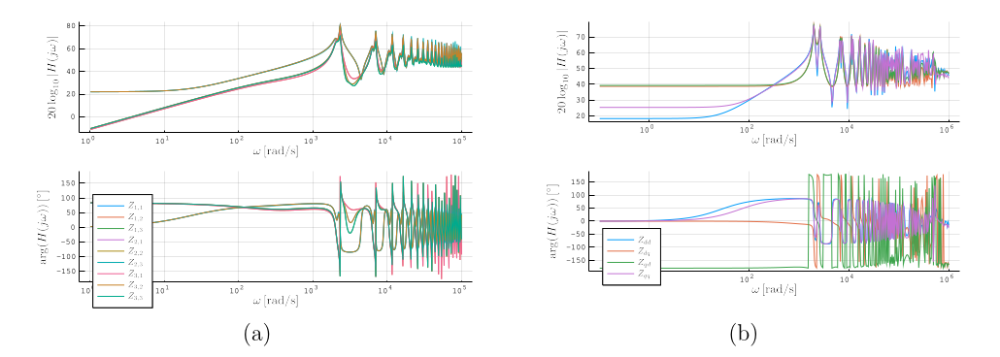

**Figure 7:** Short circuit impedance of the three phase overhead line: (a) without applied transformation; (b) with applied transformation.

- A three-phase capacitor set described as  $C\dot{\mathbf{v}}_{abc} = \mathbf{i}_{abc}$  gives

$$\mathbf{Y}_{dq}(j\omega) = \begin{bmatrix} j\omega C & \omega_0 C \\ -\omega_0 C & j\omega C \end{bmatrix},$$

which corresponds to the results given in [RimHuCho1990](@cite).

In the case of ABCD parameters (given in the  $abc$  domain), the same transformation can be applied to every matrix  $\mathbf{A}$ ,  $\mathbf{B}$ ,  $\mathbf{C}$  and  $\mathbf{D}$ . The new matrices ABCD parameters in the  $dq$  domain are:

$$\begin{aligned}
\mathbf{A}_{dq}(j\omega)
    &= \frac{1}{3}\left.
       \left\{\mathbf{a}\mathbf{A}\!\left[j(\omega + \omega_0)\right]
       + \bar{\mathbf{a}}\mathbf{A}\!\left[j(\omega - \omega_0)\right]\right\}
       \Re\{\mathbf{a}\}^{T}\right|_{dq}, \\
\mathbf{B}_{dq}(j\omega)
    &= \frac{1}{3}\left.
       \left\{\mathbf{a}\mathbf{B}\!\left[j(\omega + \omega_0)\right]
       + \bar{\mathbf{a}}\mathbf{B}\!\left[j(\omega - \omega_0)\right]\right\}
       \Re\{\mathbf{a}\}^{T}\right|_{dq}, \\
\mathbf{C}_{dq}(j\omega)
    &= \frac{1}{3}\left.
       \left\{\mathbf{a}\mathbf{C}\!\left[j(\omega + \omega_0)\right]
       + \bar{\mathbf{a}}\mathbf{C}\!\left[j(\omega - \omega_0)\right]\right\}
       \Re\{\mathbf{a}\}^{T}\right|_{dq}, \\
\mathbf{D}_{dq}(j\omega)
    &= \frac{1}{3}\left.
       \left\{\mathbf{a}\mathbf{D}\!\left[j(\omega + \omega_0)\right]
       + \bar{\mathbf{a}}\mathbf{D}\!\left[j(\omega - \omega_0)\right]\right\}
       \Re\{\mathbf{a}\}^{T}\right|_{dq}.
\end{aligned}$$

### Transformation from bipolar to equivalent monopolar representation

In a coupled $dq$/DC converter model, one scalar port represents the DC-side
connection and two coordinates represent the AC side. A bipolar DC subnetwork can
therefore be reduced to an equivalent $1 \times 1$ monopolar representation at the
converter boundary.

Bipolar DC components are represented by means of ABCD parameters as:

$$\begin{bmatrix} \mathbf{A} & \mathbf{B} \\ \mathbf{C} & \mathbf{D} \end{bmatrix} = \begin{bmatrix} a_{11} & a_{12} & b_{11} & b_{12} \\ a_{21} & a_{22} & b_{21} & b_{22} \\ c_{11} & c_{12} & d_{11} & d_{12} \\ c_{21} & c_{22} & d_{21} & d_{22} \end{bmatrix},$$

and

$$\begin{bmatrix} v_{p1} \\ v_{p2} \\ i_{p1} \\ i_{p2} \end{bmatrix} = \begin{bmatrix} \mathbf{A} & \mathbf{B} \\ \mathbf{C} & \mathbf{D} \end{bmatrix} \times \begin{bmatrix} v_{s1} \\ v_{s2} \\ i_{s1} \\ i_{s2} \end{bmatrix}.$$

For balanced bipolar DC networks connected to power converters or DC sources, the following relation is valid:  $v_{s1} = -v_{s2} = \frac{v_s}{2}$  and  $i_{s1} = -i_{s2} = i_s$ . At the input of the DC network component, it is known that  $v_p = v_{p1} - v_{p2}$  and  $i_{p1} = -i_{p2} = i_p$ . Substituting these relationships, the equation becomes:

$$\begin{bmatrix} v_p \\ i_p \end{bmatrix} = \begin{bmatrix} \frac{a_{11}+a_{22}-a_{12}-a_{21}}{2} & \frac{b_{11}+b_{22}-b_{12}-b_{21}}{2} \\ \frac{c_{11}+c_{22}-c_{12}-c_{21}}{2} & \frac{d_{11}+d_{22}-d_{12}-d_{21}}{2} \end{bmatrix} \times \begin{bmatrix} v_s \\ i_s \end{bmatrix},$$

which represents the equivalent single-port model.

### Reduction of the ABCD matrix

In the case of cross-bonded cable when the outer conducting layers are grounded, it is necessary to reduce the ABCD parameters matrix. For that purpose it can be applied ABCD matrix reduction formula.

The overall ABCD matrix is divided into parts: matrix part with the superscript 11 should be kept (e.g. core layer of the cable), 22 should be removed (e.g. belongs to the sheath and armor) and 12 and 21 are their interconnections.

$$\begin{bmatrix} \mathbf{A} & \mathbf{B} \\ \mathbf{C} & \mathbf{D} \end{bmatrix} = \begin{bmatrix} \mathbf{A}_{11} & \mathbf{A}_{12} & \mathbf{B}_{11} & \mathbf{B}_{12} \\ \mathbf{A}_{21} & \mathbf{A}_{22} & \mathbf{B}_{21} & \mathbf{B}_{22} \\ \mathbf{C}_{11} & \mathbf{C}_{12} & \mathbf{D}_{11} & \mathbf{D}_{12} \\ \mathbf{C}_{21} & \mathbf{C}_{22} & \mathbf{D}_{21} & \mathbf{D}_{22} \end{bmatrix}$$

The new, reduced matrix is obtained by applying the formula:

$$\begin{aligned} \tilde{\mathbf{A}} &= \mathbf{A}_{11} - (\mathbf{A}_{12}\mathbf{Z}_s + \mathbf{B}_{12}) \mathbf{E} (\mathbf{Z}_p \mathbf{C}_{21} + \mathbf{A}_{21}), \\ \tilde{\mathbf{B}} &= \mathbf{B}_{11} - (\mathbf{A}_{12}\mathbf{Z}_s + \mathbf{B}_{12}) \mathbf{E} (\mathbf{Z}_p \mathbf{D}_{21} + \mathbf{B}_{21}), \\ \tilde{\mathbf{C}} &= \mathbf{C}_{11} - (\mathbf{C}_{12}\mathbf{Z}_s + \mathbf{D}_{12}) \mathbf{E} (\mathbf{Z}_p \mathbf{C}_{21} + \mathbf{A}_{21}), \\ \tilde{\mathbf{D}} &= \mathbf{D}_{11} - (\mathbf{C}_{12}\mathbf{Z}_s + \mathbf{D}_{12}) \mathbf{E} (\mathbf{Z}_p \mathbf{D}_{21} + \mathbf{B}_{21}), \\ \mathbf{E} &= \left[(\mathbf{A}_{22} \mathbf{Z}_s + \mathbf{B}_{22}) + \mathbf{Z}_p (\mathbf{C}_{22} \mathbf{Z}_s + \mathbf{D}_{22})\right]^{-1}. \end{aligned}$$

where $\mathbf{Z}_p$ and $\mathbf{Z}_s$ are diagonal matrices containing the
terminating impedances of the input and output ports to be eliminated.

Newly defined ABCD parameters are:

$$\begin{bmatrix} \tilde{\mathbf{A}} & \tilde{\mathbf{B}} \\ \tilde{\mathbf{C}} & \tilde{\mathbf{D}} \end{bmatrix}.$$

### Relationships to other multiport parameterizations

Although ABCD parameters can only be properly defined when the number of input and output nodes (voltages and currents) are the same, this multiport representation has multiple advantages:

- The input and output multiport impedance can be found directly.
- There is the unique representation of the each multiport network using ABCD parameters. For instance, ABCD parameters are defined even in cases where the admittance matrix does not exist, e.g., in case of a infinite shunt admittance.

- ABCD parameters operate with voltages and currents and thus, the values inside the ABCD matrix have a clear physical dimension and “meaning”. This cannot be said for H (hybrid) parameters, which is usually used for RF and microelectronics simulations.
- There is a unique relationship between multiport  $Z$ ,  $Y$ ,  $H$ ,  $S$  and ABCD multiport parameters [Reveyrand2018, Frickey1994](@cite).

By the definition Z parameters, or impedance parameters, provide relation between voltages and currents of the multiport network.

$$\begin{bmatrix} \mathbf{V}_p \\ \mathbf{V}_s \end{bmatrix} = \mathbf{Z} \times \begin{bmatrix} \mathbf{I}_p \\ \mathbf{I}_s \end{bmatrix}$$

Similarly, Y parameters, or admittance parameters, give relation between currents and voltages.

$$\begin{bmatrix} \mathbf{I}_p \\ \mathbf{I}_s \end{bmatrix} = \mathbf{Y} \times \begin{bmatrix} \mathbf{V}_p \\ \mathbf{V}_s \end{bmatrix}$$

Hybrid parameters are defined as

$$\begin{bmatrix} \mathbf{V}_p \\ \mathbf{I}_s \end{bmatrix} = \mathbf{H} \times \begin{bmatrix} \mathbf{I}_p \\ \mathbf{V}_s \end{bmatrix}$$

and S parameters like scattering parameters, are defined in terms of incident **a** and reflected **b** waves:

$$\begin{bmatrix} \mathbf{a}_p \\ \mathbf{b}_p \end{bmatrix} = \mathbf{S} \times \begin{bmatrix} \mathbf{a}_s \\ \mathbf{b}_s \end{bmatrix}.$$

## Multiport admittance representation

The system can also be described using $\mathbf{Y}$ parameters. Component
admittance matrices can be obtained from their ABCD representations using the
conversion given below, after which the network equations are assembled in nodal
form. For an $N$-node network, the relationship between currents injected at the
nodes $\{I_1, \dots, I_N\}$ and node voltages $\{V_1, \dots, V_N\}$ is

$$\begin{bmatrix} Y_{1,1} & Y_{1,2} & \cdots & Y_{1,k} & \cdots & Y_{1,N} \\ Y_{2,1} & Y_{2,2} & \cdots & Y_{2,k} & \cdots & Y_{2,N} \\ \vdots & \vdots & \ddots & \vdots & \ddots & \vdots \\ Y_{k,1} & Y_{k,2} & \cdots & Y_{k,k} & \vdots & Y_{k,N} \\ \vdots & \vdots & \ddots & \vdots & \ddots & \vdots \\ Y_{N,1} & Y_{N,2} & \cdots & Y_{N,k} & \cdots & Y_{N,N} \end{bmatrix} \begin{bmatrix} V_1 \\ V_2 \\ \vdots \\ V_k \\ \vdots \\ V_N \end{bmatrix} = \begin{bmatrix} I_1 \\ I_2 \\ \vdots \\ I_k \\ \vdots \\ I_N \end{bmatrix}$$

### Input impedance determination

As with ABCD parameters, $\mathbf{Y}$ parameters can be used to determine the
impedance between selected input and output ports. First construct an $N \times N$
zero matrix $\mathbf{M}$, then set
$\mathbf{M}\langle k_i,k_i\rangle = 1$ for every selected node-current index
$k_i$, $i \in \{1, \dots, N\}$.

$$\begin{bmatrix} Y_{1,1} & Y_{1,2} & \cdots & Y_{1,k_i} & \cdots & Y_{1,N} \\ Y_{2,1} & Y_{2,2} & \cdots & Y_{2,k_i} & \cdots & Y_{2,N} \\ \vdots & \vdots & \ddots & \vdots & \ddots & \vdots \\ Y_{k_i,1} & Y_{k_i,2} & \cdots & Y_{k_i,k_i} & \vdots & Y_{k_i,N} \\ \vdots & \vdots & \ddots & \vdots & \ddots & \vdots \\ Y_{N,1} & Y_{N,2} & \cdots & Y_{N,k_i} & \cdots & Y_{N,N} \end{bmatrix} \begin{bmatrix} V_1 \\ V_2 \\ \vdots \\ V_k \\ \vdots \\ V_N \end{bmatrix} = \mathbf{M} \begin{bmatrix} I_1 \\ I_2 \\ \vdots \\ I_k \\ \vdots \\ I_N \end{bmatrix},$$

When $\mathbf{Y}$ is diagonalizable and nonsingular, its inverse can be obtained
from the eigenvalue decomposition [Xu2005](@cite):

$$\mathbf{Z} = \mathbf{Y}^{-1} = \mathbf{T} \mathbf{\Lambda}^{-1} \mathbf{T}^{-1},$$

where $\mathbf{T}$ contains the right eigenvectors and $\mathbf{\Lambda}$ contains
the eigenvalues of $\mathbf{Y}$. For a singular matrix, the corresponding
Moore--Penrose pseudoinverse uses $\mathbf{\Lambda}^{+}$ in place of
$\mathbf{\Lambda}^{-1}$.

The impedances between the selected input and output ports are then

$$\mathbf{Z}_{eq} = \mathbf{Z} \mathbf{M}$$

and to pick only the values on the positions corresponding to the input and output nodes.

In order to get the impedance “visible” from the input nodes, it is necessary to perform Kron elimination of the output nodes as the last step [DorflerBullo2013](@cite).

### Reduction of the $\mathbf{Z}$ and $\mathbf{Y}$ matrix

Here we apply the so-called Kron reduction [DorflerBullo2013](@cite), often used for reducing grounded conducting layers of the overhead lines and cables. It will be formulated only for the  $\mathbf{Y}$  parameters, but it can be applied in exactly the same way for  $\mathbf{Z}$  parameters.

The  $\mathbf{Y}$  matrix is divided into four parts: the matrix part with the superscript 11 should be kept, 22 should be eliminated and 12 and 21 are the interconnections.

$$\mathbf{Y} = \begin{bmatrix} \mathbf{Y}_{11} & \mathbf{Y}_{12} \\ \mathbf{Y}_{21} & \mathbf{Y}_{22} \end{bmatrix}$$

The new  $\mathbf{Y}$  parameters are then given by:

$$\tilde{\mathbf{Y}} = \mathbf{Y}_{11} - \mathbf{Y}_{12} \mathbf{Y}_{22}^{-1} \mathbf{Y}_{21}.$$

### Transformation between $\mathbf{Y}$ and ABCD parameters

The  $\mathbf{Y}$  matrix can be separated into submatrices belonging to input (superscript “p”), output (superscript “s”), and their interconnecting nodes as:

$$\mathbf{Y} = \begin{bmatrix} \mathbf{Y}_{pp} & \mathbf{Y}_{ps} \\ \mathbf{Y}_{sp} & \mathbf{Y}_{ss} \end{bmatrix}.$$

The  $\mathbf{Y}$  parameters in the previous form can be obtained from ABCD parameters as follows:

$$\mathbf{Y} = \begin{bmatrix} \mathbf{DB}^{-1} & \mathbf{C} - \mathbf{DB}^{-1}\mathbf{A} \\ -\mathbf{B}^{-1} & \mathbf{B}^{-1}\mathbf{A} \end{bmatrix}.$$

Similarly, ABCD parameters can be determined from  $\mathbf{Y}$  parameters as:

$$\begin{bmatrix} \mathbf{A} & \mathbf{B} \\ \mathbf{C} & \mathbf{D} \end{bmatrix} = \begin{bmatrix} -\mathbf{Y}_{sp}^{-1} \mathbf{Y}_{ss} & -\mathbf{Y}_{sp}^{-1} \\ \mathbf{Y}_{ps} - \mathbf{Y}_{pp} \mathbf{Y}_{sp}^{-1} \mathbf{Y}_{ss} & -\mathbf{Y}_{sp}^{-1} \mathbf{Y}_{pp} \end{bmatrix}.$$

## Component models

The principal components of a hybrid AC/DC power system include AC and DC grid
equivalents, impedances, transformers, transmission lines and cables, shunt
components, and power-electronic converters. This section presents the multiport
models from which the network representation is assembled.

### Impedance

An impedance can be defined between  $n$  input ports (nodes) and  $n$  output ports (nodes). An impedance is represented as an  $n \times n$  matrix  $\mathbf{Z}$ :

$$\mathbf{Z} = \begin{bmatrix} Z_{11} & Z_{12} & \cdots & Z_{1n} \\ \vdots & \vdots & \ddots & \vdots \\ Z_{n1} & Z_{n2} & \cdots & Z_{nn} \end{bmatrix}$$

An example of an impedance with two input ports and two output ports is given in Fig. 8.

**Figure 8:** Model of the 2 input ports/2 output ports impedance.

To represent impedances as multiport components with ABCD parameters, the following equation constructed using the Modified Nodal Analysis (MNA) approach [HoRuehliBrennan1975](@cite) needs to be solved.

$$\underbrace{\left[ \begin{array}{c|c} \text{diag}_i \left\{ \sum_{j, Z_{ij} \neq 0} \frac{1}{Z_{ij}} \right\}_{n \times n} & \text{diag}\{-1\}_{n \times n} \\ \hline \mathbf{N}_{1,n \times n} & \mathbf{0}_{n \times n} \end{array} \right]}_{\mathbf{M}_1} \times \begin{bmatrix} \mathbf{V}_p \\ \mathbf{I}_p \end{bmatrix} = \underbrace{\left[ \begin{array}{c|c} \mathbf{N}_{2,n \times n} & \mathbf{0}_{n \times n} \\ \hline -\text{diag}_i \left\{ \sum_{j, Z_{ji} \neq 0} \frac{1}{Z_{ji}} \right\}_{n \times n} & \text{diag}\{-1\}_{n \times n} \end{array} \right]}_{\mathbf{M}_2} \times \begin{bmatrix} \mathbf{V}_s \\ \mathbf{I}_s \end{bmatrix},$$

where matrices  $\mathbf{N}_1$  and  $\mathbf{N}_2$  consist of  $n$  rows with  $n$  columns with entries at the position  $(i, j)$  equal to  $-\frac{1}{Z_{ji}}$  and  $\frac{1}{Z_{ij}}$ , for  $Z_{ij} \neq 0$  and  $Z_{ji} \neq 0$  (where  $i$  represents row and  $j$  column in impedance matrix), respectively. The solution of the previous system is given as  $\mathbf{M}_1^{-1}\mathbf{M}_2$  if  $\mathbf{M}_1$  is invertible matrix, or by determining LU decomposition and reduced row echelon form if it is not invertible.

For example, for the circuit depicted in Fig. 8, the equations would be:

$$\left[ \begin{array}{cc|cc} \frac{1}{Z_{11}} + \frac{1}{Z_{12}} & 0 & -1 & 0 \\ 0 & \frac{1}{Z_{21}} + \frac{1}{Z_{22}} & 0 & -1 \\ \hline -\frac{1}{Z_{11}} & -\frac{1}{Z_{21}} & 0 & 0 \\ -\frac{1}{Z_{12}} & -\frac{1}{Z_{22}} & 0 & 0 \end{array} \right] \times \begin{bmatrix} V_{11} \\ V_{12} \\ I_{11} \\ I_{12} \end{bmatrix} = \left[ \begin{array}{cc|cc} \frac{1}{Z_{11}} & \frac{1}{Z_{12}} & 0 & 0 \\ \frac{1}{Z_{21}} & \frac{1}{Z_{22}} & 0 & 0 \\ \hline -\left(\frac{1}{Z_{11}} + \frac{1}{Z_{21}}\right) & 0 & -1 & 0 \\ 0 & -\left(\frac{1}{Z_{12}} + \frac{1}{Z_{22}}\right) & 0 & -1 \end{array} \right] \times \begin{bmatrix} V_{21} \\ V_{22} \\ I_{21} \\ I_{22} \end{bmatrix}.$$

### Transformer

A transformer is modeled as in Fig. 9. The parameters of the transformer can be defined explicitly or determined from on-site test data as described in [MartinezVelasco2017](@cite). On-site test data are typically presented in the form of open and short-circuit values of the primary side voltage  $V_1$  and current  $I_1$  and secondary side voltage  $V_2$  and current  $I_2$ , along with the core power losses  $P_{1,core}$  and winding power losses  $P_{1,winding}$ . The open and short-circuit test should be performed on the secondary side.

Then the parameters from Fig. 9 can be estimated as:

$$\begin{aligned} R_{ps} &= \frac{P_1^{short}}{(I_1^{short})^2}, & L_{ps} &= \frac{Q_1^{short}}{\omega(I_1^{short})^2}, \\ R_m &= \frac{(V_1^{open})^2}{P_1^{open}}, & L_m &= \frac{(V_1^{open})^2}{\omega Q_1^{open}}, \\ n &= \frac{V_1^{open}}{V_2^{open}}, \\ R_p &= \frac{R_{ps}}{2}, & L_p &= \frac{L_{ps}}{2}, \\ R_s &= \frac{R_{ps}}{2n^2}, & L_s &= \frac{L_{ps}}{2n^2}, \end{aligned}$$

knowing that  $Q_1^{o,s} = \sqrt{(V_1^{o,s} I_1^{o,s})^2 - P_1^{o,s2}}$ .

ABCD multiport parameters are then estimated as [BayoSalas2018, Wu2014](@cite):

$$\begin{bmatrix} A & B \\ C & D \end{bmatrix} = \mathbf{Y}_{turn} \times (\mathbf{Z}_{winding}^p \times \mathbf{Y}_{iron} \times \mathbf{N}_{tr} \times \mathbf{Z}_{winding}^s \parallel \mathbf{Z}_{stray}) \times \mathbf{Y}_{turn},$$

where  $\mathbf{Y}_{turn} = \begin{bmatrix} 1 & 0 \\ sC_t & 1 \end{bmatrix}$ ,  $\mathbf{Z}_{winding}^p = \begin{bmatrix} 1 & sL_p + R_p \\ 0 & 1 \end{bmatrix}$ ,  $\mathbf{Y}_{iron} = \begin{bmatrix} 1 & 0 \\ \frac{1}{sL_m} + \frac{1}{R_m} & 1 \end{bmatrix}$ ,  $\mathbf{Z}_{winding}^s = \begin{bmatrix} 1 & sL_s + R_s \\ 0 & 1 \end{bmatrix}$ ,  $\mathbf{Z}_{stray} = \begin{bmatrix} 1 & \frac{1}{sC_{stray}} \\ 0 & 1 \end{bmatrix}$  and  $\mathbf{N}_{tr} = \begin{bmatrix} n & 0 \\ 0 & \frac{1}{n} \end{bmatrix}$ , with  $n$  the turn ratio.

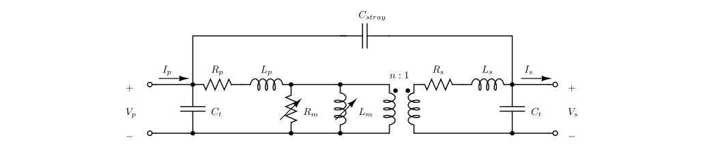

**Figure 9:** Model of the transformer.

Three-phase transformers can be either in the YY and  $\Delta$ Y configuration, where each of the three single-phase transformers is represented by its equivalent from Fig. 9.

- The YY configuration follows directly by placing three identical single-phase
  models on the diagonal:

$$\begin{bmatrix} \mathbf{A} & \mathbf{B} \\ \mathbf{C} & \mathbf{D} \end{bmatrix} = \begin{bmatrix} \text{diag}\{\mathbf{A}\}_{3 \times 3} & \text{diag}\{\mathbf{B}\}_{3 \times 3} \\ \text{diag}\{\mathbf{C}\}_{3 \times 3} & \text{diag}\{\mathbf{D}\}_{3 \times 3} \end{bmatrix}.$$

- The  $\Delta$ Y configuration is more complex and it is modeled using following equations. The inner primary and secondary stages of the transformer (i.e. all the components except

the parasitic capacitances and the load impedance) are given by:

$$\begin{bmatrix} A & B \\ C & D \end{bmatrix}_{inner} = \mathbf{Z}_{winding}^p \times \mathbf{Y}_{iron} \times \mathbf{N}_{tr} = \begin{bmatrix} n + n (sL_p + R_p) \left( \frac{1}{sL_m} + \frac{1}{R_m} \right) & \frac{sL_p + R_p}{n} \\ n \left( \frac{1}{L_m} + \frac{1}{R_m} \right) & \frac{1}{n} \end{bmatrix}.$$

The  $\Delta Y$  configuration transforms voltages from the delta side  $v_p^{a,b,c}$  to the wye side voltages  $v_s^{a,b,c}$  as  $v_p^{a,b,c} = \sqrt{3} v_s^{a,b,c}$ , while the currents are related as:

$$\mathbf{i}_p^{a,b,c} = \begin{bmatrix} \frac{1}{\sqrt{3}} & 0 & -\frac{1}{\sqrt{3}} \\ -\frac{1}{\sqrt{3}} & \frac{1}{\sqrt{3}} & 0 \\ 0 & -\frac{1}{\sqrt{3}} & \frac{1}{\sqrt{3}} \end{bmatrix} \times \mathbf{i}_s^{a,b,c}.$$

Combining these voltage/current relations with the inner ABCD transfer function
gives the following inner impedance representation:

$$\mathbf{Z}_{inner} = \left[ \begin{array}{c|c} \text{diag}\{A_{inner}\sqrt{3}\}_{3 \times 3} & \text{diag}\{\frac{B_{inner}}{\sqrt{3}}\}_{3 \times 3} \\ \hline \text{diag}\{C_{inner}\sqrt{3}\}_{3 \times 3} & \begin{matrix} \frac{D_{inner}}{\sqrt{3}} & 0 & -\frac{D_{inner}}{\sqrt{3}} \\ -\frac{D_{inner}}{\sqrt{3}} & \frac{D_{inner}}{\sqrt{3}} & 0 \\ 0 & -\frac{D_{inner}}{\sqrt{3}} & \frac{D_{inner}}{\sqrt{3}} \end{matrix} \end{array} \right].$$

The transformer is eventually represented using ABCD parameters as:

$$\begin{bmatrix} \mathbf{A} & \mathbf{B} \\ \mathbf{C} & \mathbf{D} \end{bmatrix} = (\mathbf{Y}_{turn} \times (\mathbf{Z}_{inner} \parallel \mathbf{Z}_{stray}) \times \mathbf{Y}_{turn}).$$

### Autotransformer

This type of model may be expanded into a multi-winding transformer, e.g., a three-winding transformer. As an example, the positive and negative, and zero sequence impedance of an autotransformer with YNa0(d) configuration is shown in Fig 10. In Fig. 10, H, X and Y refer to the high-voltage, low-voltage and tertiary voltage side respectively. The per unit leakage impedances may be obtained from the per unit leakage impedances  $Z_{HX}$ ,  $Z_{HY}$  and  $Z_{XY}$ , as obtained using the short-circuit test, and impedance to ground  $Z_g$  as [Anderson1995](@cite):

$$\begin{bmatrix} Z_X \\ Z_Y \\ Z_Z \end{bmatrix} = \frac{1}{2} \begin{bmatrix} 1 & 1 & -1 \\ 1 & -1 & 1 \\ -1 & 1 & 1 \end{bmatrix} \begin{bmatrix} Z_{HX} \\ Z_{HY} \\ Z_{XY} \end{bmatrix}, \text{ and}$$

$$\begin{bmatrix} Z_{X0} \\ Z_{Y0} \\ Z_{n0} \end{bmatrix} = \frac{1}{2} \begin{bmatrix} 1 & 1 & -1 & \frac{n-1}{n} \\ 1 & -1 & 1 & -\frac{n-1}{n^2} \\ -1 & 1 & 1 & \frac{1}{n} \end{bmatrix} \begin{bmatrix} Z_{HX} \\ Z_{HY} \\ Z_{XY} \\ 6Z_g \end{bmatrix},$$

where  $n$  is the winding transformation ratio. The phase (or physical) domain model may be derived from these sequence impedances using the Fortescue transform.

### Transmission line

The ABCD model parameters of a transmission line can be defined as [CastellanosMarti1997, MorchedGustavsenTartibi1999](@cite)

$$\begin{bmatrix} \mathbf{A} & \mathbf{B} \\ \mathbf{C} & \mathbf{D} \end{bmatrix} = \begin{bmatrix} \cosh(\Gamma l) & \mathbf{Y}_c^{-1} \sinh(\Gamma l) \\ \mathbf{Y}_c \sinh(\Gamma l) & \cosh(\Gamma l) \end{bmatrix}$$

where  $\Gamma = \sqrt{\mathbf{Z}\mathbf{Y}}$  and  $\mathbf{Y}_c = \mathbf{Z}^{-1} \Gamma$ , and  $l$  standing for the line or cable length. The used formula is based on the frequency-dependent phase domain model.

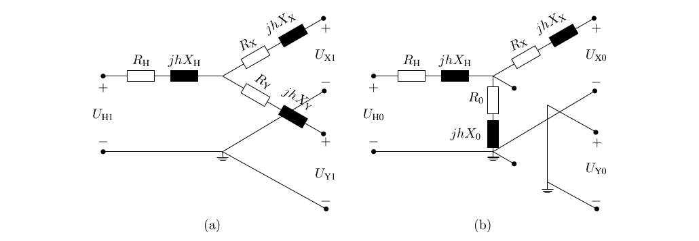

**Figure 10:** Three-winding transformer model for autotransformer with YNa0(d) configuration in positive and negative sequence (a) and zero sequence (b).

#### Overhead line

Based on realizations of the transmission line as defined in PSCAD, see Fig. 11, five possible realizations are defined as:

1. flat (horizontal, which presents flat configuration without ground wires),
2. vertical,
3. delta (for at least three phases),
4. offset (for at least three phases),
5. concentric (for at least three phases).

Besides, the conductor positions can be added manually as absolute  $(x, y)$  positions.

The overhead-line geometry is described by the **conductor** properties in Table 1
and the **ground-wire** properties in Table 2 [MartinezVelasco2017](@cite).

The transmission line model is constructed using the procedure from [MartinezVelasco2017, ManitobaHVDC2003](@cite). The overhead transmission line consists of  $n_b$  including sub-conductors, stranding, etc. and  $n_g$  ground wires.

Each line/conductor positioned as  $x_c$  relatively starting from the central tower position and  $y_c$  vertically, measured from ground, with the sag at the midpoint between towers  $d_{sag}$ , see Fig. 12a. Thus, the modified vertical position is used in calculations as  $\hat{y}_c = y_c - \frac{2}{3}d_{sag}$ . Conductor is formed using  $n_{sb}$  sub-conductors grouped in the bundle, where all sub-conductors are grouped using symmetrical equidistant pattern with the distance between the two nearest sub-conductors being  $d_{bc}$ , or a bundle spacing. Using the conductor position, the position of each subconductor can be estimated. The angular separation between two subconductors and the bundle radius are

$$\begin{aligned}\varphi &= \frac{360^\circ}{n_{sb}}, \\ r &= \frac{d_{sb}}{2 \sin(\varphi/2)}.\end{aligned}$$

**Table 1. Overhead-line conductor and bundle geometry.**

| Symbol                  | Meaning                                                                                     |
|:-----------------------:|:--------------------------------------------------------------------------------------------|
| $n_b$                   | number of bundles (or a number of phases)                                                   |
| $n_{sb}$                | number of subconductors per bundle                                                          |
| $y_{bc}$                | height of the lowest bundle above ground                                                    |
| $\Delta y_{bc}$         | vertical offset between bundles                                                             |
| $\Delta x_{bc}$         | horizontal offset between the lowest bundles                                                |
| $\Delta \tilde{x}_{bc}$ | horizontal offset in the case of concentric and offset organization                         |
| $d_{sb}$                | distance between closest subconductors with equidistant concentric organization (symmetric) |
| $d_{sag}$               | maximal sag offset                                                                          |
| $r_c$                   | radius of the conductor                                                                     |
| $R_{dc}$                | DC resistance of the conductor                                                              |
| $g_c$                   | shunt conductance of the conductor                                                          |
| $\mu_{r,c}$             | relative permeability of the conductor                                                      |
| positions               | manually specified conductor coordinates                                                    |
| organization            | flat, vertical, concentric, delta, or offset arrangement                                    |

**Table 2. Overhead-line ground-wire properties.**

| Symbol       | Meaning                                                          |
|:------------:|:-----------------------------------------------------------------|
| $n_g$        | number of ground wires                                           |
| $\Delta x_g$ | relative horizontal distance between ground wires                |
| $\Delta y_g$ | relative vertical distance between ground wires and the lowest conductors |
| $r_g$        | radius of the ground wire                                        |
| $d_{g,sag}$  | ground wire sag                                                  |
| $R_{g,dc}$   | DC resistance of the ground wires                                |
| $\mu_{r,g}$  | relative permeability of the ground wire                         |

The individual positions can be estimated starting from the angle  $\varphi_s = \frac{\pi}{2}$  if the number of sub-conductors is odd, or from  $\varphi_s = \frac{\pi+\varphi}{2}$  for an even number of sub-conductors, as follows:

$$\begin{aligned} x_{bc} &= x_c + r \cos(\varphi_s + k \varphi), \\ y_{bc} &= y_c + r \sin(\varphi_s + k \varphi) - \frac{2}{3} d_{sag}, \end{aligned}$$

for  $k \in \{1, 2, \dots, n_{bc}\}$ . If the number of sub-conductors is equal to one, its position is given by  $(x_c, \hat{y}_c)$ . Each conductor is characterized with the relative permeability of the material  $\mu_r$ , the conductor dc resistance  $R_{dc}$  and the radius  $r_i$ .

Ground wires are modeled similarly, represented with their relative position  $(x_g, y_g)$ , radius  $r_g$ , dc resistance  $R_{g,dc}$  and relative permeability of the material  $\mu_r$ .

Earth parameters are given with permeability  $\mu_e$ , permittivity  $\epsilon_e$  and conductivity  $\rho_e$ .

In order to represent the transmission line using ABCD parameters, it is necessary to calculate series impedance and shunt admittance matrices [MartinezVelasco2017](@cite). Both matrices are of the size  $n \times n$ , where  $n = \sum_{i=1}^{n_c} n_{bc}^i + n_g$ . The impedance matrix has the following form:

$$\mathbf{Z} = \text{diag}(Z_i) + \begin{bmatrix} Z_{0,11} & \cdots & Z_{0,1n} \\ \vdots & \ddots & \vdots \\ Z_{0,n1} & \cdots & Z_{0,nn} \end{bmatrix}$$

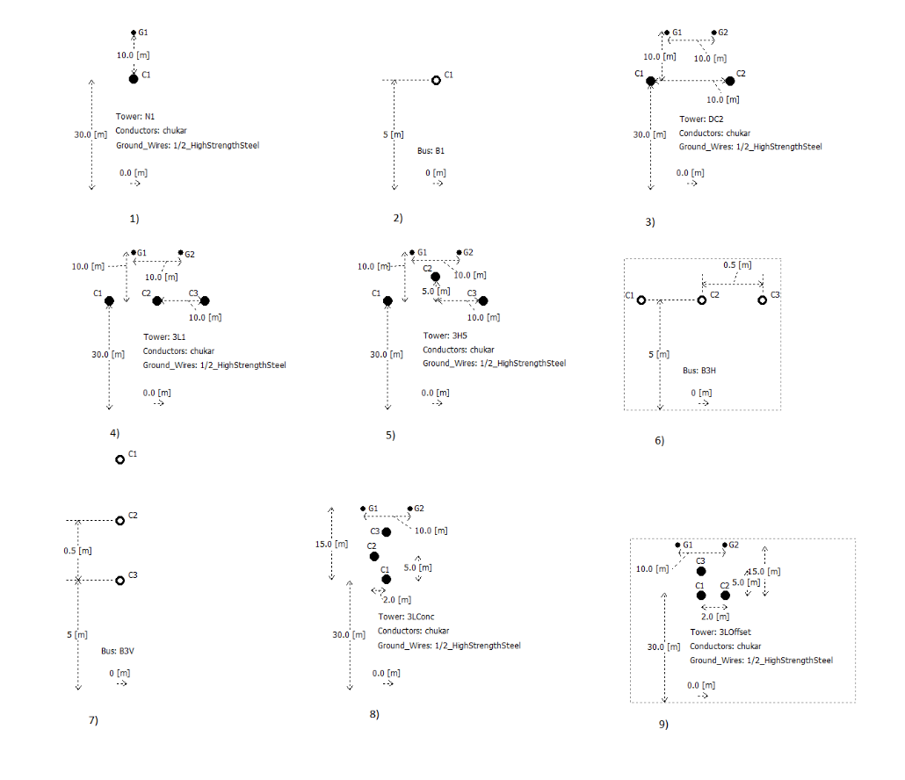

**Figure 11:** PSCAD overhead line organization: 1) single conductor with groundwire; 2) single conductor; 3) 2 conductors flat; 4) 3 conductors flat; 5) 3 conductors delta; 6) 3 conductors horizontal; 7) 3 conductors vertical; 8) 3 conductors concentric; 9) 3 conductors offset.

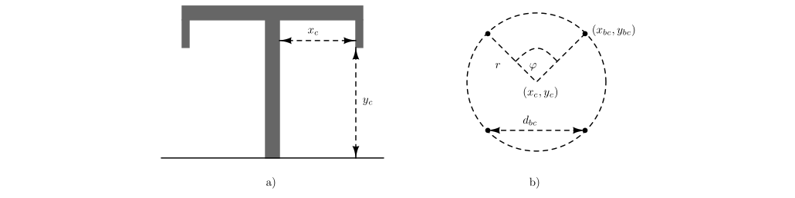

**Figure 12:** Overhead line modelling: a) tower and relative conductor positions; b) sub-conductor bundle.

For the $i$-th conductor, subconductor, or ground wire,

$$\begin{aligned}
Z_i
    &= \frac{m\rho_i}{2\pi r_i}\coth(0.733mr_i)
       + \frac{0.3179\rho_i}{\pi r_i^2}, \\
\rho_i
    &= R_{dc}^i\pi r_i^2, \\
m
    &= \sqrt{j\omega\frac{\mu_0\mu_{r,i}}{\rho_i}},
\end{aligned}$$

where $r_i$ is the conductor radius and $\rho_i$ is its resistivity. The self and
mutual earth-return terms are

$$Z_{0,ij} =
\frac{j\omega\mu_0}{2\pi}
\log\!\left(\frac{\hat{D}_{ij}}{d_{ij}}\right),$$

where

$$\begin{aligned} d_{ij} &= \begin{cases} \sqrt{(x_i - x_j)^2 + (y_i - y_j)^2}, & i \neq j, \\ r_i, & i = j, \end{cases} \\ D_{ij} &= \begin{cases} \sqrt{(x_i - x_j)^2 + (y_i + y_j)^2}, & i \neq j, \\ 2y_i, & i = j, \end{cases} \\ \hat{D}_{ij} &= \sqrt{(y_i + y_j + 2d_e)^2 + (x_i - x_j)^2}, \\ d_e &= \sqrt{\frac{1}{j\omega\mu_e(\sigma_e + j\omega\epsilon_e)}}. \end{aligned}$$

The shunt admittance is a matrix formed as

$$\mathbf{Y} = s \mathbf{P}^{-1} + \mathbf{G}$$

from matrix  $\mathbf{P}$  with its components  $\mathbf{P}_{ij} = \frac{1}{2\pi\epsilon_0} \log\left(\frac{D_{ij}}{d_{ij}}\right)$  and  $\mathbf{G} = \text{diag}\{g_c\}$ .

#### Cable

The cable geometry may represent underground coaxial cables directly buried in
soil or placed inside a pipe. A coaxial cable is built from alternating conducting
and insulating layers.

The cable formulation considers groups of coaxial cables. A group contains $n$
cables, each with up to three conducting layers and three insulation layers, as
shown in Fig. 13. The conducting layers are the core, sheath, and armour. For each
conductor, $r_i^c$ and $r_o^c$ are its inner and outer radii, $\mu_r^c$ is its
relative permeability, and $\rho_c$ is its resistivity in
$[\Omega\,\mathrm{m}]$. For each insulation layer, $r_i^i$ and $r_o^i$ are its
inner and outer radii, $\epsilon^i$ is its relative permittivity, and $\mu_r^i$
is its relative permeability.

**Figure 13:** Coaxial cable.

Additionally, the configuration parameters can be modified by adding two semiconducting layers in the insulator 1, and implementing the sheath consisting of the wire screen and outer sheath layer. In that case, the procedure described in [Wu2014](@cite) is applied.

- Conductor surface impedance

A hollow conductor surface impedance is given by:

$$\begin{aligned}
Z_{aa}
    &= \frac{\rho^c m}{2\pi r_i^c}
       \coth\!\left[m(r_o^c - r_i^c)\right]
       + \frac{\rho^c}{2\pi r_i^c(r_i^c + r_o^c)}
         \left[\frac{\Omega}{m}\right]
       && \text{for the inner surface,} \\
Z_{bb}
    &= \frac{\rho^c m}{2\pi r_o^c}
       \coth\!\left[m(r_o^c - r_i^c)\right]
       + \frac{\rho^c}{2\pi r_o^c(r_i^c + r_o^c)}
         \left[\frac{\Omega}{m}\right]
       && \text{for the outer surface,} \\
Z_{ab}
    &= \frac{\rho^c m}{\pi(r_i^c + r_o^c)}
       \operatorname{csch}\!\left[m(r_o^c - r_i^c)\right]
       \left[\frac{\Omega}{m}\right].
\end{aligned}$$

where  $m = \sqrt{j\omega\mu_r^c}$ . For a non-hollow conductor, the outer surface impedance is

$$Z_{bb} = \frac{\rho^c m}{2\pi r_o^c} \coth(0.733mr_o^c) + \frac{0.3179\rho^c}{\pi r_o^{c2}} \left[ \frac{\Omega}{m} \right].$$

- The insulator layer between two conductors has an impedance

$$Z_i = \frac{j\omega\mu_0\mu_r^i}{2\pi} \log\left(\frac{r_o^i}{r_i^i}\right).$$

- The earth return impedance of the cable and mutual between cables is

$$Z_g = \frac{j\omega\mu_g}{2\pi}
\left[
    -\log\!\left(\frac{\gamma mD}{2}\right)
    + \frac{1}{2}
    - \frac{2}{3}mH
\right],$$

for

$$\begin{aligned} D &= \begin{cases} \sqrt{(x_i - x_j)^2 + (y_i - y_j)^2} & \text{for cables } i \neq j, \\ r_i & \text{radius of the cable } i, \end{cases} \\ H &= \begin{cases} y_i + y_j & \text{for cables } i \neq j, \\ 2y_i & \text{for the cable } i, \end{cases} \end{aligned}$$

and  $\gamma \approx 0.5772156649$  being Euler's constant.

According to [Ametani1980, DeArizonDommel1987](@cite), one cable is represented with its series impedance  $\mathbf{Z}_{ii}$  matrix. Each matrix  $\mathbf{Z}_{ii}$  has the size  $n_c \times n_c$  and its entries for  $j \in \{1, \dots, n_c - 1\}$  are given by

$$\begin{aligned} \mathbf{Z}_{ii} \langle j, j \rangle &= Z_{bb}^j + Z_i^j + Z_{aa}^{j+1}, \\ \mathbf{Z}_{ii} \langle j, j+1 \rangle &= Z_{ii} \langle j+1, j \rangle = -Z_{ab}^{j+1}, \\ \mathbf{Z}_{ii} \langle n_c, n_c \rangle &= Z_{bb}^{n_c} + Z_i^{n_c} + Z_g^{ii}, \end{aligned}$$

and otherwise the matrix entries are 0.

Mutual surface impedances between the cables are given by matrix  $\mathbf{Z}_{ij}$  having all components equal to  $Z_g^{ij}$ .

The shunt admittance matrix can be estimated as  $\mathbf{Y} = s\mathbf{P}^{-1}$  and matrix  $P$ , which has the form

$$\mathbf{P} = \begin{bmatrix} \mathbf{P}_{11} & \mathbf{P}_{12} & \cdots & \mathbf{P}_{1n} \\ \vdots & \ddots & & \vdots \\ \mathbf{P}_{n1} & \mathbf{P}_{n2} & \cdots & \mathbf{P}_{nn} \end{bmatrix}.$$

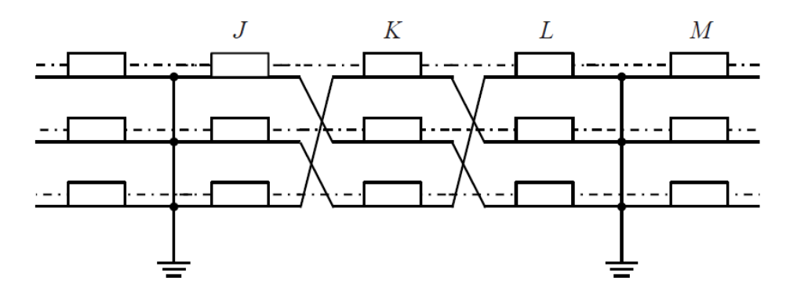

**Figure 14:** Cross-bonded cable.

Matrices  $\mathbf{P}_{ii}$  have components

$$\mathbf{P}_{ii} = \begin{bmatrix} P_c + P_s + P_a & P_s + P_a & P_a \\ P_s + P_a & P_s + P_a & P_a \\ P_a & P_a & P_a \end{bmatrix} + \begin{bmatrix} P_{ii} & P_{ii} & P_{ii} \\ P_{ii} & P_{ii} & P_{ii} \\ P_{ii} & P_{ii} & P_{ii} \end{bmatrix},$$

where  $P_{c,s,a}$  belong respectively to core, shield and armor insulators and have the following values:  $P = \frac{\log(r_o/r_i)}{2\pi\epsilon}$  and  $P_{ii} = \frac{\log(2h_i/r)}{2\pi\epsilon_0}$  is a earth return. Matrices  $\mathbf{P}_{ij}$ , for  $i \neq j$ , have all components equal to  $P_{ij} = \frac{\log(D_2/D_1)}{2\pi\epsilon_0}$ , where  $D_1 = \sqrt{(x_i - x_j)^2 + (y_i - y_j)^2}$  and  $D_2 = \sqrt{(x_i - x_j)^2 + (y_i + y_j)^2}$  [Ametani1980](@cite).

When the sheath and armour are grounded, Kron reduction can eliminate their
internal variables [DeLeonMarquezAsensioAlvarezCordero2011, RivasMarti2002](@cite).
Applying the reduction to $\mathbf{Y}$ and $\mathbf{Z}$ gives compact shunt-
admittance and series-impedance matrices; the transmission-line relations above
then give the corresponding ABCD parameters.

#### Cross-bonded cables

Cables are cross-bonded in order to reduce sheath circulating currents. The cross-bonding is made by transposing sheaths of the cable sections. As in [Wu2014](@cite), this transposition can be made in ABCD domain.

Cross-bonded cables consists of minor sections as in Fig. 14, where the smaller sections (referred to as minor sections) are marked with J, K and L. Minor sections are then grouped into bigger (major) sections, for which all the cable layers except the core are short connected to ground. Thus, the ABCD parameters of the major section can be estimated using Kron elimination.

The procedure for determining the ABCD parameters of the whole cross-bonded cable is as follows:

Let us assume that the ABCD parameters of each major section are marked as  $ABCD_\eta^r$ . Thus, the equivalent cable ABCD parameters are given by  $ABCD = \prod_{\eta=1}^n ABCD_\eta^r$ , where  $n$  is the number of major sections.

The equivalent ABCD parameters of one major section can be estimated as follows:

- Determine the ABCD parameters of the each minor section inside the major:  $ABCD_{\eta,i}$ , for  $i \in \{1, m\}$  and  $m$  is the number of the minor sections inside  $\eta$  major section.

- Reorganize the ABCD matrix for each minor section as:  $M_{\eta,i} = \mathbf{R} ABCD_{\eta,i} \mathbf{R}^{-1}$ . The matrix  $\mathbf{R}$  is a transposition matrix that sorts voltages and currents from the form:  $[V_{1,c}, V_{1,s}, V_{2,c}, \dots, I_{1,c}, I_{1,s}, I_{2,c}, \dots]^T$  into  $[V_{1,c}, V_{2,c}, V_{3,c}, V_{1,s}, \dots, I_{1,c}, I_{2,c}, I_{3,c}, \dots]^T$ . Basically, it groups first all core cable voltages, then all sheath voltages, ...
- Apply transposition from A-B-C to C-A-B for all minor sections except for the first:  $\mathbf{M}_{CB} \mathbf{T} \mathbf{M}_{\eta,i} \mathbf{T}^{-1}$ , where  $\mathbf{M}_{CB}$  introduces sheath cross-bonding losses. Matrix  $\mathbf{M}_{CB}$  is the identity matrix except for the indices that belong to interconnections of sheath voltages and currents. For example, assuming that  $n_c = 3$  (this is the number of the cables), the sheath is the second layer of the total  $n_l$  layers and thus  $\mathbf{M}_{CB} (n_c + 1 : 2n_c, n_c * n_l + n_c + 1 : n_c * n_l + 2n_c)$ . The impedance  $Z_{CB}$  presents the impedance from nonideal bonding.
- Apply the ABCD reduction described under [Reduction of the ABCD matrix](@ref).

According to the previous description, the ABCD parameters of the major section are given by:

$$ABCD_{\eta} = M_{\eta,1} \times \prod_{i=2}^m \mathbf{M}_{CB} (\mathbf{T} \mathbf{M}_{\eta,i} \mathbf{T}^{-1})$$

#### Mixed OHL-cables

Mixed OHL-cable components contain OHLs and cable sections.. Each OHL and cable section is characterized individually and a complete 'mixed OHL-cable' component is presented with the equivalent ABCD representation.

This ABCD representation has the form:

$$ABCD = \prod_{\eta=1}^n ABCD_{\eta},$$

where  $ABCD_{\eta}$  are the ABCD parameters of an OHL or cable section, while  $n$  is the total number of sections.

### AC and DC grid equivalents

AC and DC grid equivalents can be modelled as either ideal AC and DC sources respectively, or including an equivalent impedance (e.g. short-circuit impedance to model the system strength) . These sources are described using the following relations:

$$\begin{aligned} \mathbf{V}_p &= \mathbf{V}_s + \mathbf{Z} \mathbf{I}_s + \mathbf{V}, \\ \mathbf{I}_p &= \mathbf{I}_s, \end{aligned}$$

for  $\mathbf{V}$  being the vector of the voltage source's voltages,  $\mathbf{Z}$  the series equivalent impedance as diagonal matrix with the values:  $\mathbf{Z} = \text{diag}\{Z_s\}$ . As explained in 2 with  $\mathbf{I}_p$  and  $\mathbf{V}_p$  are presented input voltage source currents and voltages, while with  $\mathbf{I}_s$  and  $\mathbf{V}_s$  the output currents and voltages.

For the estimation of the equivalent impedance of the network, independent voltage sources are short-circuited, which means that in this case, the grid ABCD parameters can be represented as an identity matrix. Additionally, the internal grid impedance can be added as an serial connection of the impedance and voltage source. The ABCD parameters of the equivalent network are now given by:

$$\begin{bmatrix} \mathbf{A} & \mathbf{B} \\ \mathbf{C} & \mathbf{D} \end{bmatrix} = \begin{bmatrix} \mathbf{I} & \mathbf{Z} \\ \mathbf{0} & \mathbf{I} \end{bmatrix}.$$

### MMC

Modular multilevel converters (MMCs) are widely used as voltage-source converters
in HVDC systems. Their small-signal model must retain not only the impedance seen
from the AC and DC terminals, but also the dynamic coupling between both sides.
The converter is therefore represented by a multiport admittance matrix that
connects its DC and three-phase AC terminal variables.

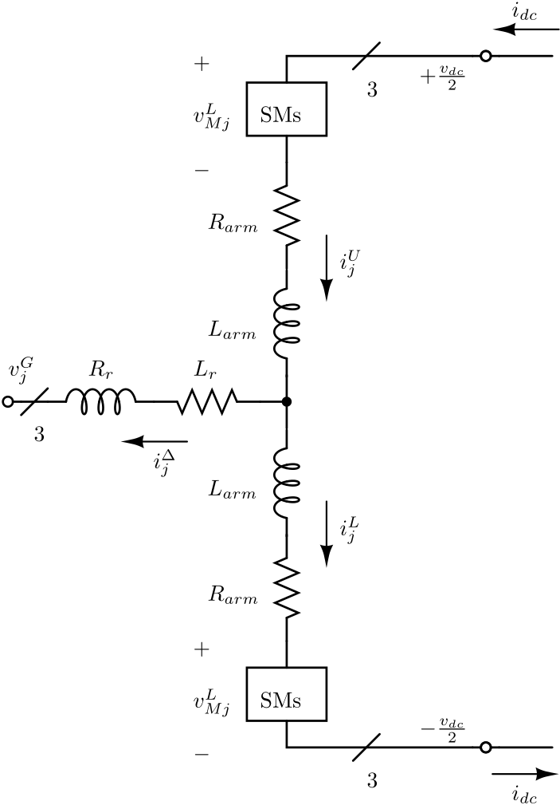

**Figure 15:** MMC.

#### MMC model

An MMC is depicted in Fig. 15. The variables from Fig. 15 are defined for all three phases,  $j \in \{a, b, c\}$ . The sets of submodules are represented by their averaged equivalent, and thus, the following equations for voltages and currents can be written:

$$\begin{aligned} v_{Mj}^{U,L} &= m_j^{U,L} v_{Cj}^{U,L}, \\ i_{Mj}^{U,L} &= m_j^{U,L} i_j^{U,L}, \end{aligned}$$

where  $m_j^{U,L}$  are the corresponding insertion indices.

Using  $\Sigma - \Delta$  nomenclature, the variables can be represented as:

$$\begin{aligned}
i_j^\Delta &= i_j^U - i_j^L, & i_j^\Sigma &= \frac{i_j^U + i_j^L}{2}, \\
v_{Cj}^\Delta &= \frac{v_{Cj}^U - v_{Cj}^L}{2}, & v_{Cj}^\Sigma &= \frac{v_{Cj}^U + v_{Cj}^L}{2}, \\
m_j^\Delta &= m_j^U - m_j^L, & m_j^\Sigma &= m_j^U + m_j^L, \\
v_{Mj}^\Delta &= \frac{-v_{Mj}^U + v_{Mj}^L}{2} = -\frac{m_j^\Delta v_{Cj}^\Sigma + m_j^\Sigma v_{Cj}^\Delta}{2}, \\
v_{Mj}^\Sigma &= \frac{v_{Mj}^U + v_{Mj}^L}{2} = \frac{m_j^\Sigma v_{Cj}^\Sigma + m_j^\Delta v_{Cj}^\Delta}{2},
\end{aligned}$$

To obtain the differential equations in the dqz frame, Park's transformation is
used to represent the system in rotating frames associated with different angular
frequencies. The zero-sequence $\Sigma$ components correspond to DC currents and
voltages, while the $Z_d$ and $Z_q$ components incorporate the third harmonic in
the $\Delta$ current and voltage model.

For the purpose of the modeling, the MMC converter is represented using 12 differential equations for the state variables [BergnaDiazFreytesGuillaudDArcoSuul2018, BergnaDiazZonettiSanchezOrtegaTedeschi2018](@cite):

$$\begin{aligned}
\frac{di_d^\Delta}{dt} &= -\frac{v_d^G - v_{Md}^\Delta + R_{eq}^{ac} i_d^\Delta + \omega L_{eq}^{ac} i_q^\Delta}{L_{eq}^{ac}}, \\
\frac{di_q^\Delta}{dt} &= -\frac{v_q^G - v_{Mq}^\Delta + R_{eq}^{ac} i_q^\Delta - \omega L_{eq}^{ac} i_d^\Delta}{L_{eq}^{ac}}, \\
\frac{di_d^\Sigma}{dt} &= -\frac{v_{Md}^\Sigma + R_{arm} i_d^\Sigma - 2\omega L_{arm} i_q^\Sigma}{L_{arm}}, \\
\frac{di_q^\Sigma}{dt} &= -\frac{v_{Mq}^\Sigma + R_{arm} i_q^\Sigma + 2\omega L_{arm} i_d^\Sigma}{L_{arm}}, \\
\frac{di_z^\Sigma}{dt} &= -\frac{v_{Mz}^\Sigma - \frac{v_{dc}}{2} + R_{arm} i_z^\Sigma}{L_{arm}}, \\
\frac{dv_{Cd}^\Delta}{dt} &= \frac{N}{2C_{arm}} \left[ i_z^\Sigma m_d^\Delta - \frac{i_q^\Delta m_q^\Sigma}{4} + i_d^\Sigma \left( \frac{m_d^\Delta}{2} + \frac{m_{Zd}^\Delta}{2} \right) - i_q^\Sigma \left( \frac{m_q^\Delta}{2} + \frac{m_{Zq}^\Delta}{2} \right) \right. \\
&\quad \left. + i_d^\Delta \left( \frac{m_d^\Sigma}{4} + \frac{m_z^\Sigma}{2} \right) - 2\omega C_{arm} v_{Cq}^\Delta \right], \\
\frac{dv_{Cq}^\Delta}{dt} &= -\frac{N}{2C_{arm}} \left[ \frac{i_d^\Delta m_q^\Sigma}{4} - i_z^\Sigma m_q^\Delta + i_q^\Sigma \left( \frac{m_d^\Delta}{2} - \frac{m_{Zd}^\Delta}{2} \right) + i_d^\Sigma \left( \frac{m_q^\Delta}{2} - \frac{m_{Zq}^\Delta}{2} \right) \right. \\
&\quad \left. + i_q^\Delta \left( \frac{m_d^\Sigma}{4} - \frac{m_z^\Sigma}{2} \right) - 2\omega C_{arm} v_{Cd}^\Delta \right], \\
\frac{dv_{CZd}^\Delta}{dt} &= -\frac{N}{8C_{arm}} (i_d^\Delta m_d^\Sigma + 2i_d^\Sigma m_d^\Delta + i_q^\Delta m_q^\Sigma + 2i_q^\Sigma m_q^\Delta + 4i_z^\Sigma m_{Zd}^\Delta) - 3\omega v_{CZq}^\Delta, \\
\frac{dv_{CZq}^\Delta}{dt} &= -\frac{N}{8C_{arm}} (i_q^\Delta m_d^\Sigma + 2i_d^\Sigma m_q^\Delta - i_d^\Delta m_q^\Sigma - 2i_q^\Sigma m_d^\Delta + 4i_z^\Sigma m_{Zq}^\Delta) + 3\omega v_{CZd}^\Delta,
\end{aligned}$$

$$\begin{aligned}
\frac{dv_{Cd}^\Sigma}{dt} &= \frac{N}{2C_{arm}} \left[ i_d^\Sigma m_z^\Sigma + i_z^\Sigma m_d^\Sigma + i_d^\Delta \left( \frac{m_d^\Delta}{4} + \frac{m_{Zd}^\Delta}{4} \right) - i_q^\Delta \left( \frac{m_q^\Delta}{4} - \frac{m_{Zq}^\Delta}{4} \right) \right] + 2\omega C_{arm} v_{Cq}^\Sigma, \\
\frac{dv_{Cq}^\Sigma}{dt} &= -\frac{N}{2C_{arm}} \left[ i_q^\Delta \left( \frac{m_d^\Delta}{4} - \frac{m_{Zd}^\Delta}{4} \right) - i_z^\Sigma m_q^\Sigma + i_d^\Delta \left( \frac{m_q^\Delta}{4} + \frac{m_{Zq}^\Delta}{4} \right) - i_q^\Sigma m_z^\Sigma \right] + 2\omega C_{arm} v_{Cd}^\Sigma, \\
\frac{dv_{Cz}^\Sigma}{dt} &= -\frac{N}{8C_{arm}} (i_d^\Delta m_d^\Delta + i_q^\Delta m_q^\Delta + 2i_d^\Sigma m_d^\Sigma + 2i_q^\Sigma m_q^\Sigma + 4i_z^\Sigma m_z^\Sigma),
\end{aligned}$$

where  $L_{eq}^{ac} = L_f + \frac{L_{arm}}{2}$  and  $R_{eq}^{ac} = R_f + \frac{R_{arm}}{2}$ . The state variables are  $\mathbf{x} = [\mathbf{i}_{dq}^\Delta, \mathbf{i}_{dqz}^\Sigma, \mathbf{v}_{CdqZ}^\Delta, \mathbf{v}_{Cdqz}^\Sigma]^T$ . The 12 algebraic relations used for determining 7 voltages  $[v_{Md}^\Delta, v_{Mq}^\Delta, v_{MZd}^\Delta, v_{MZq}^\Delta, v_{Md}^\Sigma, v_{Mq}^\Sigma, v_{Mz}^\Sigma]$  and insertion indeices  $[m_d^\Delta, m_q^\Delta, m_{Zd}^\Delta, m_{Zq}^\Delta, m_d^\Sigma, m_q^\Sigma, m_z^\Sigma]^T$  are given as:

$$\begin{aligned}
v_{Md}^\Delta &= \frac{m_q^\Delta v_{Cq}^\Sigma}{4} - \frac{m_d^\Delta v_{Cz}^\Sigma}{2} - \frac{m_d^\Delta v_{Cd}^\Sigma}{4} - \frac{m_{Zd}^\Delta v_{Cq}^\Sigma}{4} + \frac{m_{Zq}^\Delta v_{Cq}^\Sigma}{4} - \frac{m_d^\Sigma v_{Cd}^\Delta}{4} - \frac{m_z^\Sigma v_{Cd}^\Delta}{2} + \frac{m_q^\Sigma v_{Cd}^\Delta}{4} \\
&\quad - \frac{m_d^\Sigma v_{CZd}^\Delta}{4} + \frac{m_q^\Sigma v_{CZq}^\Delta}{4}, \\
v_{Mq}^\Delta &= \frac{m_d^\Delta v_{Cq}^\Sigma}{4} + \frac{m_q^\Delta v_{Cd}^\Sigma}{4} - \frac{m_q^\Delta v_{Cz}^\Sigma}{2} - \frac{m_{Zd}^\Delta v_{Cq}^\Sigma}{4} - \frac{m_{Zq}^\Delta v_{Cd}^\Sigma}{4} + \frac{m_d^\Sigma v_{Cq}^\Delta}{4} + \frac{m_q^\Sigma v_{Cd}^\Delta}{4} - \frac{m_z^\Sigma v_{Cq}^\Delta}{2} \\
&\quad - \frac{m_d^\Sigma v_{CZq}^\Delta}{4} - \frac{m_q^\Sigma v_{CZd}^\Delta}{4}, \\
v_{MZd}^\Delta &= -\frac{m_d^\Delta v_{Cd}^\Sigma}{4} - \frac{m_q^\Delta v_{Cq}^\Sigma}{4} - \frac{m_{Zd}^\Delta v_{Cz}^\Sigma}{2} - \frac{m_d^\Sigma v_{Cd}^\Delta}{4} - \frac{m_q^\Sigma v_{Cq}^\Delta}{4} - \frac{m_z^\Sigma v_{Zd}^\Delta}{2}, \\
v_{MZq}^\Delta &= -\frac{m_d^\Delta v_{Cq}^\Sigma}{4} - \frac{m_q^\Delta v_{Cd}^\Sigma}{4} - \frac{m_{Zq}^\Delta v_{Cz}^\Sigma}{2} - \frac{m_d^\Sigma v_{Cq}^\Delta}{4} + \frac{m_q^\Sigma v_{Cd}^\Delta}{4} - \frac{m_z^\Sigma v_{Zq}^\Delta}{2}, \\
v_{Md}^\Sigma &= \frac{m_d^\Delta v_{Cd}^\Delta}{4} - \frac{m_q^\Delta v_{Cq}^\Delta}{4} + \frac{m_d^\Delta v_{CZd}^\Delta}{4} + \frac{m_{Zd}^\Delta v_{Cd}^\Delta}{4} + \frac{m_q^\Delta v_{Zq}^\Delta}{4} + \frac{m_{Zq}^\Delta v_{Cq}^\Delta}{4} + \frac{m_d^\Sigma v_{Cz}^\Sigma}{2} + \frac{m_z^\Sigma v_{Cd}^\Sigma}{2}, \\
v_{Mq}^\Sigma &= \frac{m_q^\Delta v_{Zd}^\Delta}{4} - \frac{m_q^\Delta v_{Cd}^\Delta}{4} - \frac{m_d^\Delta v_{Zq}^\Delta}{4} - \frac{m_d^\Delta v_{Cq}^\Delta}{4} + \frac{m_{CZd}^\Delta v_{Cq}^\Delta}{4} - \frac{m_{Zq}^\Delta v_{Cd}^\Delta}{4} + \frac{m_q^\Sigma v_{Cz}^\Sigma}{2} + \frac{m_z^\Sigma v_{Cq}^\Sigma}{2}, \\
v_{Mz}^\Sigma &= \frac{m_d^\Delta v_{Cd}^\Delta}{4} + \frac{m_q^\Delta v_{Cq}^\Delta}{4} + \frac{m_{Zd}^\Delta v_{CZd}^\Delta}{4} + \frac{m_{Zq}^\Delta v_{CZq}^\Delta}{4} + \frac{m_d^\Sigma v_{Cd}^\Sigma}{4} + \frac{m_q^\Sigma v_{Cq}^\Sigma}{4} + \frac{m_z^\Sigma v_{Cz}^\Sigma}{2},
\end{aligned}$$

$$\begin{bmatrix} m_d^\Delta \\ m_q^\Delta \\ m_{Zd}^\Delta \\ m_{Zq}^\Delta \\ m_d^\Sigma \\ m_q^\Sigma \\ m_z^\Sigma \end{bmatrix} = \frac{2}{v_{dc}} \begin{bmatrix} -v_{Md,ref}^\Delta \\ -v_{Mq,ref}^\Delta \\ -v_{MZd,ref}^\Delta \\ -v_{MZq,ref}^\Delta \\ v_{Md,ref}^\Sigma \\ v_{Mq,ref}^\Sigma \\ v_{Mz,ref}^\Sigma \end{bmatrix}.$$

The set of the previous 12 differential equations and the set of algebraic equations are accompanied with the 7 equations for the reference values of the voltages  $[\mathbf{v}_{MdqZ,ref}^\Delta, \mathbf{v}_{Mdqz,ref}^\Sigma]$ . The reference voltages are given as zero by default, except for the value of  $v_{Cz,ref}^\Sigma = \frac{v_{dc}}{2}$ .

#### Operating point

The converter's operating point can be specified directly or obtained by solving
the power-flow equations of the interconnected system. In both cases, the model
requires the steady-state quantities listed in Table 3.

**Table 3. Steady-state quantities used to initialize the MMC operating point.**

| Quantity           | Meaning                                              |
|:------------------:|:-----------------------------------------------------|
| $P_{min}, P_{max}$ | minimum and maximum active AC power of the converter |
| $P$                | power flow estimated or predefined active AC power   |
| $Q_{min}, Q_{max}$ | minimum and maximum reactive power                   |
| $Q$                | power flow estimated or predefined reactive power    |
| $P_{dc}$           | power flow estimated or predefined DC power          |
| $V_{DC}$           | DC voltage                                           |
| $V_m, \theta$      | amplitude and phase of the AC voltage                |

Using these quantities, the converter equilibrium is obtained from its steady-state
equations. The power-flow solution provides the following MMC reference values:

$$\begin{aligned}
i_{d,ref}^{\Delta C} &= \frac{2}{3} \frac{(v_d^{GC} P + v_q^{GC} Q)}{v_d^{GC2} + v_q^{GC2}}, \\
i_{q,ref}^{\Delta C} &= \frac{2}{3} \frac{(v_q^{GC} P - v_d^{GC} Q)}{v_d^{GC2} + v_q^{GC2}}, \\
i_{z,ref}^{\Sigma} &= \frac{P_{dc}}{3V_{DC}}, \\
P_{ac,ref} &= P, \\
Q_{ar,ref} &= Q, \\
v_{dc,ref} &= V_{DC}, \\
W_{z,ref}^{\Sigma} &= \frac{3C_{arm}V_{DC}^2}{N}.
\end{aligned}$$

#### Control implementations

For the PI controls in the dqz frame additional equations have been developed [BergnaDiazFreytesGuillaudDArcoSuul2018, BergnaDiazZonettiSanchezOrtegaTedeschi2018, SakinciBeerten2019](@cite). The different controllers are considered to be tuned using a pole placement method. Also the PLL is implemented using a PI controller structure as in [Freytes2017](@cite).

**Phase locked loop (PLL)** The PLL is used to synchronize the converter's internal controller frequency, used to control the currents in a rotating frame, to the grid frequency. All converter variables are mapped to the dqz frame using the same Park's transformation without a phase shift.

According to Fig. 16 the following equations for PLL can be written.

$$\begin{aligned}
\frac{d\xi_{pll}}{dt} &= -v_q^{G,C}, \\
\frac{d\theta}{dt} &= \Delta\omega, \\
\Delta\omega &= -K_{p,pll} v_q^{G,C} + K_{i,pll} \xi_{pll}, \\
\omega_C &= \Delta\omega + \omega_0.
\end{aligned}$$

The output-current and circulating-current controllers operate in the converter reference frame. Their input variables are rotated into that frame before applying the control laws. The converter dynamics are expressed in the grid reference frame, so the controller outputs are rotated back with the inverse matrix:

$$T(\theta) = \begin{bmatrix} \cos(\theta) & -\sin(\theta) \\ \sin(\theta) & \cos(\theta) \end{bmatrix},$$

while its inverse is:

$$T^{-1}(\theta) = \begin{bmatrix} \cos(\theta) & \sin(\theta) \\ -\sin(\theta) & \cos(\theta) \end{bmatrix}.$$

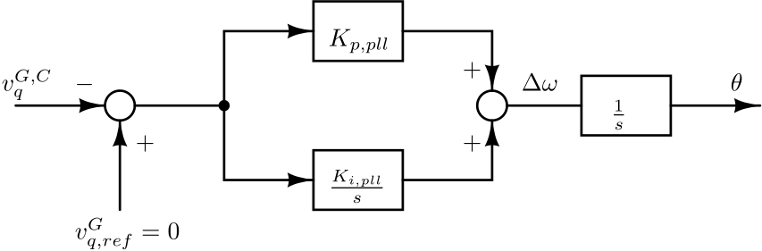

**Figure 16:** PLL implementation.

The mapping of  $i_{d,q,ref}^\Delta$  from the grid's to the converter's reference frame is done by:

$$\begin{bmatrix} i_{d,ref}^{\Delta C} \\ i_{q,ref}^{\Delta C} \end{bmatrix} = T(\theta) \begin{bmatrix} i_{d,ref}^\Delta \\ i_{q,ref}^\Delta \end{bmatrix},$$

Also currents  $i_d^\Delta$  and  $i_q^\Delta$  are mapped to:

$$\begin{bmatrix} i_d^{\Delta C} \\ i_q^{\Delta C} \end{bmatrix} = T(\theta) \begin{bmatrix} i_d^\Delta \\ i_q^\Delta \end{bmatrix}.$$

Similarly:

$$\begin{bmatrix} i_{d,ref}^{\Sigma C} \\ i_{q,ref}^{\Sigma C} \end{bmatrix} = T(-2\theta) \begin{bmatrix} i_{d,ref}^\Sigma \\ i_{q,ref}^\Sigma \end{bmatrix}, \quad \begin{bmatrix} i_d^{\Sigma C} \\ i_q^{\Sigma C} \end{bmatrix} = T(-2\theta) \begin{bmatrix} i_d^\Sigma \\ i_q^\Sigma \end{bmatrix}.$$

**DC voltage control** DC voltage control (DCC) provides the reference value for  $i_{d,ref}^{\Delta C}$ , depending of the variation of  $v_{dc}$ . The control law provides the following equations

$$\frac{dv_{dc}}{dt} = \frac{N}{6C_{arm}} (i_{dc} - 3i_z^\Sigma),$$

$$\frac{d\xi_{v_{dc}}}{dt} = v_{dc,ref} - v_{dc},$$

$$i_{d,ref}^{\Delta C} = -K_{p,dc} (v_{dc,ref} - v_{dc}) - K_{i,dc} \xi_{v_{dc}}.$$

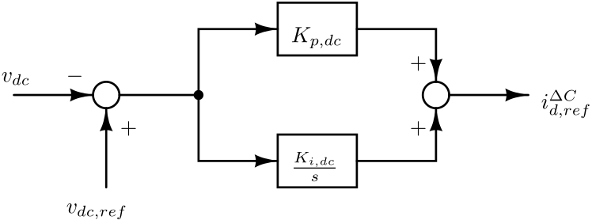

**Figure 17:** DC voltage control.

**Output current control (OCC)** defines the reference values for the output currents  $i_{d,ref}^\Delta$  and  $i_{q,ref}^\Delta$  given in the grid reference frame. This control method adds several equations:

$$\begin{aligned} \frac{d\xi_d^\Delta}{dt} &= i_{d,ref}^{\Delta C} - i_d^{\Delta C}, \\ \frac{d\xi_q^\Delta}{dt} &= i_{q,ref}^{\Delta C} - i_q^{\Delta C}, \\ v_{Md,ref}^{\Delta C} &= K_{i,occ}\xi_d^\Delta + K_{p,occ}(i_{d,ref}^{\Delta C} - i_d^{\Delta C}) + \omega_C L_{eq}^{ac} i_q^\Delta + v_d^{G,C}, \\ v_{Mq,ref}^{\Delta C} &= K_{i,occ}\xi_q^\Delta + K_{p,occ}(i_{q,ref}^{\Delta C} - i_q^{\Delta C}) - \omega_C L_{eq}^{ac} i_d^\Delta + v_q^{G,C}. \end{aligned}$$

Voltages  $v_{Md,ref}^{\Delta C}$  and  $v_{Mq,ref}^{\Delta C}$  are used in grid's reference frame for further calculations:

$$\begin{bmatrix} v_{Md,ref}^\Delta \\ v_{Mq,ref}^\Delta \end{bmatrix} = T^{-1}(\theta) \begin{bmatrix} v_{Md,ref}^{\Delta C} \\ v_{Mq,ref}^{\Delta C} \end{bmatrix}.$$

If the controller is defined only using bandwidth  $\omega_n$  and  $\zeta$  (instead of  $K_p$  and  $K_i$ ), the proportional and integral gains are tuned as:

$$\begin{aligned} K_{i,occ} &= L_{eq}^{ac} \omega_n^2, \\ K_{p,occ} &= 2\zeta\omega_n L_{eq}^{ac} - R_{eq}^{ac}. \end{aligned}$$

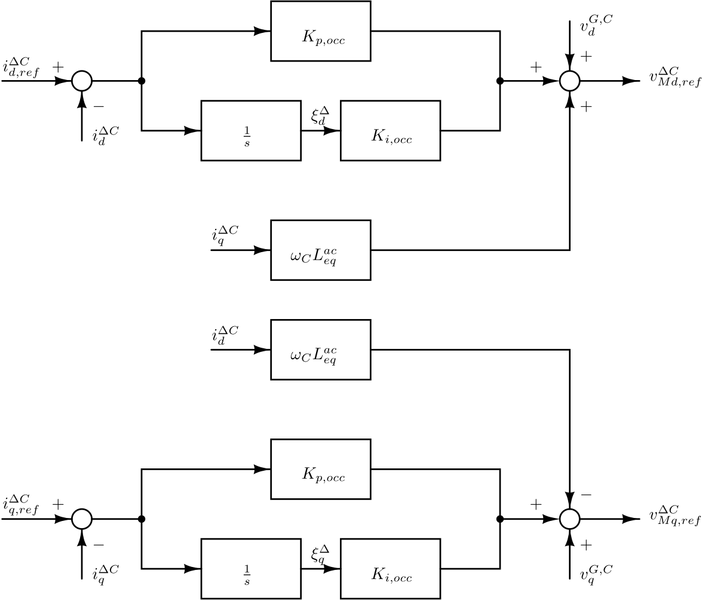

**Figure 18:** OCC implementation.

**Circulating current control (CCC)** The CCC is constructed to set the circulating current to its reference, which is considered to be  $i_{d,ref}^\Sigma = 0$ ,  $i_{q,ref}^\Sigma = 0$ .

The equations added by the CCC are:

$$\begin{aligned}\frac{d\xi_d^\Sigma}{dt} &= i_{d,ref}^\Sigma - i_d^{\Sigma C}, \\ \frac{di_q^\Sigma}{dt} &= i_{q,ref}^\Sigma - i_q^{\Sigma C}, \\ v_{Md,ref}^{\Sigma C} &= -K_{i,ccc} \xi_d^\Sigma - K_{p,ccc} (i_{d,ref}^\Sigma - i_d^{\Sigma C}) + 2\omega_C L_{arm} i_q^{\Sigma C}, \\ v_{Mq,ref}^{\Sigma C} &= -K_{i,ccc} \xi_q^\Sigma - K_{p,ccc} (i_{q,ref}^\Sigma - i_q^{\Sigma C}) - 2\omega_C L_{arm} i_d^{\Sigma C}.\end{aligned}$$

To return to the grid's reference frame, the following transformation is applied:

$$\begin{bmatrix} v_{Md,ref}^\Sigma \\ v_{Mq,ref}^\Sigma \end{bmatrix} = T^{-1}(-2\theta) \begin{bmatrix} v_{Md,ref}^{\Sigma C} \\ v_{Mq,ref}^{\Sigma C} \end{bmatrix}.$$

The proportional and integral gains are tuned as:

$$\begin{aligned}K_i &= L_{arm} \omega_n^2, \\ K_p &= 2\zeta\omega_n L_{arm} - R_{arm}.\end{aligned}$$

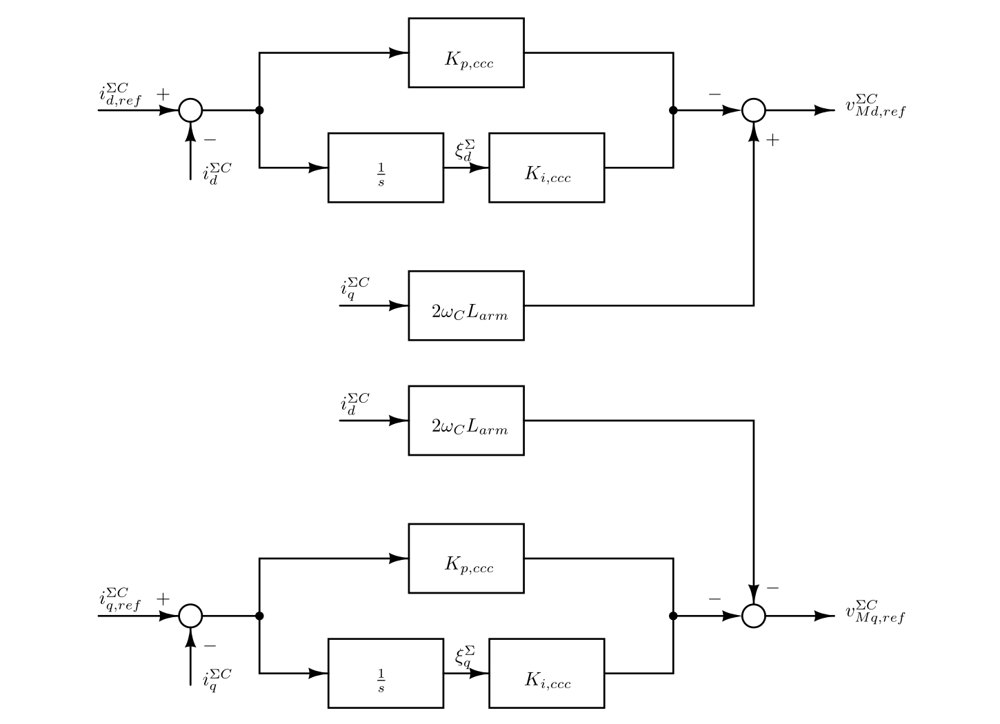

**Figure 19:** CCC implementation.

**Energy control and zero current control** The energy control is built around the “zero” energy and as a result, it provides a reference value for the ‘zero’ current  $i_{z,ref}^\Sigma$ . The energy controller involves the following equations, as visible from Fig. 20a.

$$\begin{aligned}
 W_z^\Sigma &= \frac{3C_{arm}}{2N} (v_{Cd}^{\Delta 2} + v_{Cq}^{\Delta 2} + v_{CZd}^{\Delta 2} + v_{CZq}^{\Delta 2} + v_{Cd}^{\Sigma 2} + v_{Cq}^{\Sigma 2} + 2v_{Cz}^{\Sigma 2}), \\
 \frac{d\xi_z^\Sigma}{dt} &= W_{z,ref}^\Sigma - W_z^\Sigma, \\
 P_{ac} &= \frac{3}{2} (v_d^{G,C} i_d^{\Delta C} + v_q^{G,C} i_q^{\Delta C}), \\
 i_{z,ref}^\Sigma &= \frac{K_{p,ec} (W_{z,ref}^\Sigma - W_z^\Sigma) + K_{i,ec} \xi_z^\Sigma + P_{ac}}{3v_{dc}}.
 \end{aligned}$$

Additionally, the zero current control (ZCC) sets the zero current to the desired value. The implementation of this control is depicted in Fig. 20b. It can work without the energy controller.

$$\begin{aligned}
 \frac{d\xi_z^\Sigma}{dt} &= i_{z,ref}^\Sigma - i_z^\Sigma, \\
 v_{Mz,ref}^\Sigma &= \frac{v_{dc}}{2} - K_{p,zcc} (i_{z,ref}^\Sigma - i_z^\Sigma) - K_{i,zcc} \xi_z^\Sigma.
 \end{aligned}$$

The tuning of the ZCC employs the same principles as for CCC.

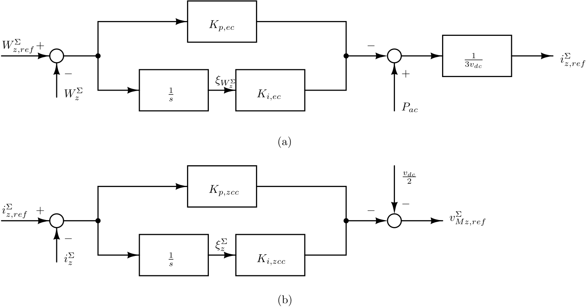

**Figure 20:** Energy control and ZCC implementation.

**Active and reactive power control** An outer control loop for the control of the active and reactive power can be added, see Fig. 21. These control loops are used to successfully estimate

the AC currents  $i_{dq,ref}^\Delta$ . The control loops operate according to the following equations:

$$\begin{aligned}
 P_{ac} &= \frac{3}{2} (v_d^{G,C} i_d^{\Delta C} + v_q^{G,C} i_q^{\Delta C}), \\
 Q_{ac} &= \frac{3}{2} (-v_d^{G,C} i_q^{\Delta C} + v_q^{G,C} i_d^{\Delta C}), \\
 \frac{d\xi_{P_{ac}}}{dt} &= P_{ac,ref} - P_{ac}, \\
 \frac{d\xi_{Q_{ac}}}{dt} &= Q_{ac,ref} - Q_{ac}, \\
 i_{d,ref}^{\Delta C} &= K_p^{P_{ac}} (P_{ac,ref} - P_{ac}) + K_i^{P_{ac}} \xi_{P_{ac}}, \\
 i_{q,ref}^{\Delta C} &= -K_p^{Q_{ac}} (Q_{ac,ref} - Q_{ac}) - K_i^{Q_{ac}} \xi_{Q_{ac}}.
 \end{aligned}$$

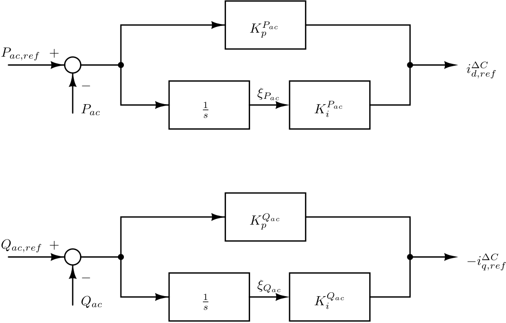

**Figure 21:** Active and reactive power control implementation.

#### Steady-state solution and admittance model

The preceding differential-algebraic system is first solved at equilibrium. It is
then linearized as a multi-input multi-output (MIMO) system, where

$\mathbf{x} = [\mathbf{i}_{dq}^\Delta \quad \mathbf{i}_{dqz}^\Sigma \quad \mathbf{v}_{CdqZ}^\Delta \quad \mathbf{v}_{Cdqz}^\Sigma]$  represent the state-variables, whereas the input vector is given as  $\mathbf{u} = [v_{dc} \quad v_d^G \quad v_q^G]$ . In order to obtain transfer functions from the input to output, which is defined as  $\mathbf{y} = [3i_z^\Sigma \quad i_d^\Delta \quad i_q^\Delta]$ , the previous equations are rewritten to satisfy the following form:

$$\begin{aligned}
 \dot{\mathbf{x}}(t) &= \mathbf{A}_{MIMO} \mathbf{x}(t) + \mathbf{B}_{MIMO} \mathbf{u}(t), \\
 \mathbf{y}(t) &= \mathbf{C}_{MIMO} \mathbf{x}(t) + \mathbf{D}_{MIMO} \mathbf{u}(t).
 \end{aligned}$$

The matrices $\mathbf{A}_{MIMO}$, $\mathbf{B}_{MIMO}$,
$\mathbf{C}_{MIMO}$, and $\mathbf{D}_{MIMO}$ are the Jacobians of the state and
output equations with respect to the states and inputs, evaluated at the
equilibrium. These Jacobians can be obtained by automatic differentiation
[RevelsLubinPapamarkou2016](@cite). Applying the Laplace transform gives

$$\begin{aligned} s\mathbf{X}(s) &= \mathbf{A}_{MIMO}\mathbf{X}(s) + \mathbf{B}_{MIMO}\mathbf{U}(s), \\ \mathbf{Y}(s) &= \mathbf{C}_{MIMO}\mathbf{X}(s) + \mathbf{D}_{MIMO}\mathbf{U}(s). \end{aligned}$$

The MIMO transfer function is thus given by:

$$\mathbf{Y}_{MMC}(s) = \mathbf{Y}(s)\mathbf{U}(s)^{-1} = \mathbf{C}_{MIMO} (s\mathbf{I} - \mathbf{A}_{MIMO})^{-1} \mathbf{B}_{MIMO} + \mathbf{D}_{MIMO}.$$

The resulting transfer matrix has the admittance form

$$\mathbf{Y}_{MMC}(s) = \begin{bmatrix} Y_{zz} & Y_{zd} & Y_{zq} \\ Y_{dz} & Y_{dd} & Y_{dq} \\ Y_{qz} & Y_{qd} & Y_{qq} \end{bmatrix}$$

which relates the current vector
$[i_{dc}(s), i_d^\Delta(s), i_q^\Delta(s)]^T$ to the voltage vector
$[v_{dc}(s), v_d^G(s), v_q^G(s)]^T$.

The port arrangement is illustrated in Fig. 22.

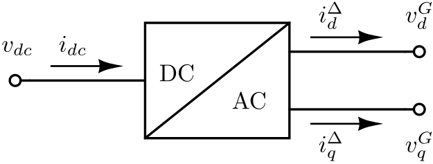

**Figure 22:** MMC block model.

Because ABCD parameters require the same number of input and output ports, the
asymmetric MMC port relation is retained in the admittance matrix
$\mathbf{Y}_{MMC}$.

When the converter controls the DC voltage, the input and output vectors become
$\mathbf{u} = [i_{dc}\ v_d^G\ v_q^G]$ and
$\mathbf{y} = [v_{dc}\ i_d^\Delta\ i_q^\Delta]$. The same MIMO representation
applies after exchanging the roles of $v_{dc}(s)$ and $i_{dc}(s)$ in the port
description.

### Shunt reactor

The shunt-reactor formulation covers single-phase and three-phase devices and can
account explicitly for winding layers. Each phase winding is formed by connecting
its layers in series, as represented in Fig. 23(a). The single-phase equivalent in
Fig. 23(b) models inductances, resistances, and parasitic capacitances as lumped
components.

A shunt reactor is characterised by the parameters in Table 4 [Wu2014](@cite).
For a three-phase reactor, the phases share the same parameter set and may be
connected in wye or delta.

**Table 4. Layered shunt-reactor parameters.**

| Quantity    | Meaning                                                                             |
|:-----------:|:------------------------------------------------------------------------------------|
| $n_\phi$    | the number of phases                                                                |
| $N$         | the number of layers                                                                |
| $L_k$       | the series inductance of layer $k$ , with $k = 1, \dots, N$                         |
| $R_k$       | the series resistance of layer $k$ , with $k = 1, \dots, N$                         |
| $C_k$       | the cross-over capacitance of layer $k$ , with $k = 1, \dots, N$                    |
| $C_{k,k-1}$ | the inter-layer capacitance between layers $k$ and $k - 1$ , with $k = 2, \dots, N$ |
| $C_{1,E}$   | the capacitance between layer 1 and the earthed screen                              |

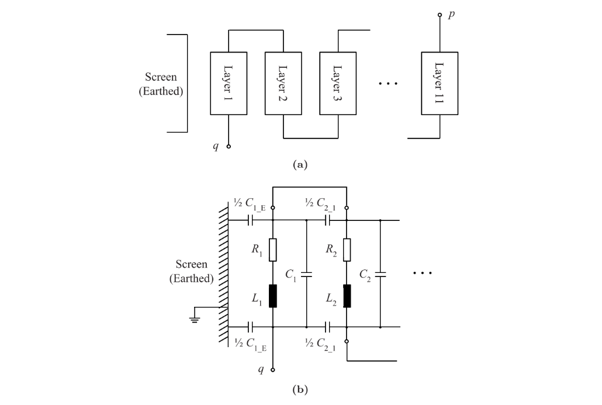

**Figure 23:** (a) Layers configuration and (b) equivalent circuit diagram for the shunt reactor [Wu2014](@cite)

When the inductance, resistance, cross-over capacitance, and inter-layer
capacitance are known for every layer, those values are used directly. Otherwise,
the layer values can be derived from total or average quantities, for every $k$,
as

$$\begin{aligned}
L_k &= \frac{L_{\text{tot}}}{N}, &
R_k &= \frac{R_{\text{tot}}}{N}, \\
C_k &= C_{\text{CO, avg}}, &
C_{k,k-1} &= C_{\text{IL, avg}}.
\end{aligned}$$

where CO stands for *cross-over* and IL stands for *inter-layer*.

#### Calculation of the ABCD matrix

The procedure first obtains the ABCD matrix for an $N$-port component with the
layers disconnected: $N$ terminals on the $p$ side and $N$ terminals on the $q$
side. Boundary conditions then connect the layers in series. The corresponding
$2N$-by-$2N$ ABCD matrix is

$$\mathbf{ABCD} = \mathbf{K}_{\text{CIL},q\text{-side}} \cdot \mathbf{K}_{\text{RLC}} \cdot \mathbf{K}_{\text{CIL},p\text{-side}}$$

where the matrices are defined as (see Fig. 24):

**ABCD** for the overall N-port component with all layers disconnected;

$\mathbf{K}_{CIL,p-side}$  for the N-port component comprising all p-side inter-layer capacitors;

$\mathbf{K}_{RLC}$  the N-port component comprising the RL series components in parallel with the cross-over capacitors;

$\mathbf{K}_{CIL,q-side}$  for the N-port component comprising all q-side inter-layer capacitors.

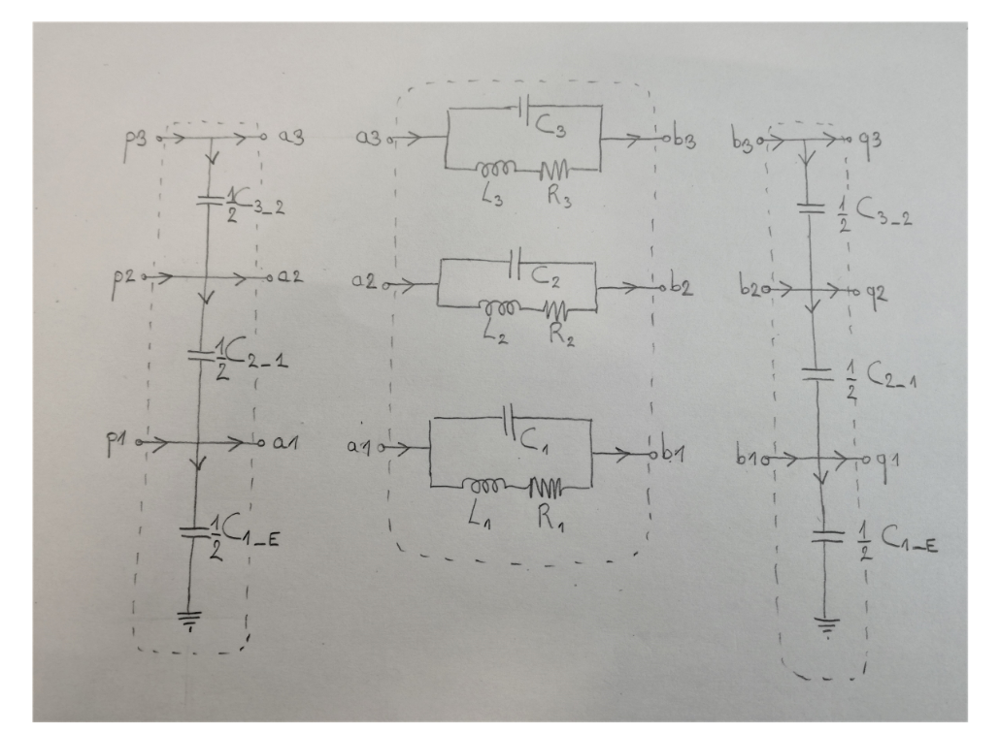

**Figure 24:** Calculation example for  $N = 3$

##### Matrix $\mathbf{K}_{RLC}$

Matrix  $\mathbf{K}_{RLC}$  can be obtained by writing the following set of equations:

$$\begin{cases} I_{b1} = I_{a1} \\ I_{b2} = I_{a2} \\ \vdots \\ I_{bN} = I_{aN} \\ U_{b1} = U_{a1} - \left[(sL_1 + R_1)^{-1} + sC_1\right]^{-1} I_{a1} \\ U_{b2} = U_{a2} - \left[(sL_2 + R_2)^{-1} + sC_2\right]^{-1} I_{a2} \\ \vdots \\ U_{bN} = U_{aN} - \left[(sL_N + R_N)^{-1} + sC_N\right]^{-1} I_{aN} \end{cases}$$

which results in an ABCD matrix of the form:

$$\mathbf{K}_{RLC} = \begin{bmatrix} \mathbf{I} & \mathbf{Z} \\ \mathbf{0} & \mathbf{I} \end{bmatrix},$$

with in particular the block element  $\mathbf{Z}$ :

$$\mathbf{Z} = \begin{bmatrix} -\left[(sL_1 + R_1)^{-1} + sC_1\right]^{-1} & 0 & \cdots & 0 \\ 0 & -\left[(sL_2 + R_2)^{-1} + sC_2\right]^{-1} & \cdots & 0 \\ \vdots & \vdots & \ddots & \vdots \\ 0 & 0 & \cdots & -\left[(sL_N + R_N)^{-1} + sC_N\right]^{-1} \end{bmatrix}.$$

##### Matrices $\mathbf{C}_{IL-LE,p}$ and $\mathbf{C}_{IL-LE,q}$

Matrices  $\mathbf{C}_{IL-LE,p}$  and  $\mathbf{C}_{IL-LE,q}$  can be obtained by writing the following set of equations, for example for matrix  $\mathbf{C}_{IL-LE,p}$ :

$$\begin{cases} U_{a1} = U_{p1} \\ U_{a2} = U_{p2} \\ \vdots \\ U_{aN} = U_{pN} \\ I_{a1} = I_{p1} - s\frac{1}{2}C_{1,E}(U_{p1} - 0) + s\frac{1}{2}C_{2,1}(U_{p2} - U_{p1}) \\ I_{a2} = I_{p2} - s\frac{1}{2}C_{2,1}(U_{p2} - U_{p1}) + s\frac{1}{2}C_{3,2}(U_{p3} - U_{p2}) \\ \vdots \\ I_{aN} = I_{pN} - s\frac{1}{2}C_{N,N-1}(U_{pN} - U_{p(N-1)}) \end{cases}$$

which results in matrices of the form:

$$\mathbf{K}_{CIL,q-side} = \begin{bmatrix} \mathbf{I} & \mathbf{0} \\ \mathbf{Y}_q & \mathbf{I} \end{bmatrix}, \quad \mathbf{K}_{CIL,p-side} = \begin{bmatrix} \mathbf{I} & \mathbf{0} \\ \mathbf{Y}_p & \mathbf{I} \end{bmatrix}.$$

with in particular the block elements  $\mathbf{Y}_p$  and  $\mathbf{Y}_q$ :

$$\mathbf{Y}_p = \mathbf{Y}_q = s\frac{1}{2} \begin{bmatrix} -C_{1,E} - C_{2,1} & C_{2,1} & 0 & 0 & \cdots & 0 & 0 & 0 \\ C_{2,1} & -C_{2,1} - C_{3,2} & C_{3,2} & 0 & \cdots & 0 & 0 & 0 \\ 0 & C_{3,2} & -C_{3,2} - C_{4,3} & C_{4,3} & \cdots & 0 & 0 & 0 \\ \vdots & & & & \ddots & & & \vdots \\ 0 & 0 & 0 & 0 & \cdots & C_{N-1,N-2} & -C_{N-1,N-2} - C_{N,N-1} & C_{N,N-1} \\ 0 & 0 & 0 & 0 & \cdots & 0 & C_{N,N-1} & -C_{N,N-1} \end{bmatrix}.$$

#### Application of the boundary conditions

The application of the boundary conditions allows to define the connections of the layers in series, such as:

$$p_1 \longleftrightarrow p_2$$

$$q_2 \longleftrightarrow q_3$$

$$p_3 \longleftrightarrow p_4$$

$$q_4 \longleftrightarrow q_5$$

$$\vdots$$

which results in the following set of conditions:

$$\left\{ \begin{array}{l} U_{p1} = U_{p2} \\ U_{q2} = U_{q3} \\ U_{p3} = U_{p4} \\ U_{q4} = U_{q5} \\ \vdots \\ I_{p1} + I_{p2} = 0 \\ I_{q2} + I_{q3} = 0 \\ I_{p3} + I_{p4} = 0 \\ I_{q4} + I_{q5} = 0 \\ \vdots \end{array} \right.$$

These conditions can be imposed to the system by a series of rows and columns operations. A transformation from **ABCD** to **Y** makes the application of the boundary conditions easier, as it gathers all voltages in the input vector and all currents in the output vector.

$$\begin{bmatrix} \mathbf{U}_q \\ \mathbf{I}_q \end{bmatrix} = \begin{bmatrix} \mathbf{A} & \mathbf{B} \\ \mathbf{C} & \mathbf{D} \end{bmatrix} \begin{bmatrix} \mathbf{U}_p \\ \mathbf{I}_p \end{bmatrix} \longrightarrow \begin{bmatrix} \mathbf{I}_p \\ \mathbf{I}_q \end{bmatrix} = \begin{bmatrix} -\mathbf{B}^{-1}\mathbf{A} & \mathbf{B}^{-1} \\ \mathbf{C} - \mathbf{D}\mathbf{B}^{-1}\mathbf{A} & \mathbf{D}\mathbf{B}^{-1} \end{bmatrix} \begin{bmatrix} \mathbf{U}_p \\ \mathbf{U}_q \end{bmatrix}$$

The equality of voltages  $U_x$  and  $U_y$  is expressed by adding column  $y$  to column  $x$ , removing column  $y$  and replacing  $U_x$  by  $U_z$ . This voltage is an intermediate voltage of the series connection which is not relevant and will be eliminated later.

The condition  $I_x + I_y = 0$  is imposed by adding row  $y$  to row  $x$ . Row  $y$  is then removed and  $I_x$  is replaced by zero.

#### Reduction of the system

The reduction eliminates the intermediate voltages from the voltage vector and the zero entries from the current vector. First, the intermediate voltages are exchanged with the zero entries using the procedure in [Wu2014](@cite). The columns associated with zero currents and the rows associated with intermediate voltages can then be removed.

Eventually, we obtain an admittance description of the form:

$$\begin{bmatrix} \mathbf{I}_i \\ \mathbf{I}_o \end{bmatrix} = \begin{bmatrix} Y_{11} & Y_{12} \\ Y_{21} & Y_{22} \end{bmatrix} \begin{bmatrix} \mathbf{U}_i \\ \mathbf{U}_o \end{bmatrix}$$

#### Single-phase and three-phase connections

For all connections presented in Fig. 25, we obtain an ABCD representation in the form of:

$$\begin{bmatrix} \mathbf{U}_o \\ \mathbf{I}_o \end{bmatrix} = \begin{bmatrix} \mathbf{I} & \mathbf{0} \\ \mathbf{Y} & \mathbf{I} \end{bmatrix} \begin{bmatrix} \mathbf{U}_i \\ \mathbf{I}_i \end{bmatrix}$$

where **I** and **0** are the identity and zero matrices of adequate size; **U** and **I** are scalar for the single phase connection and vectors for the three-phase configurations, e.g.:

$$\mathbf{U}_o = \begin{bmatrix} U_{Ao} \\ U_{Bo} \\ U_{Co} \end{bmatrix}$$

The terminal admittance is then obtained from the retained entries $Y_{11}$ and
$Y_{12}$ of the reduced two-terminal layer model:

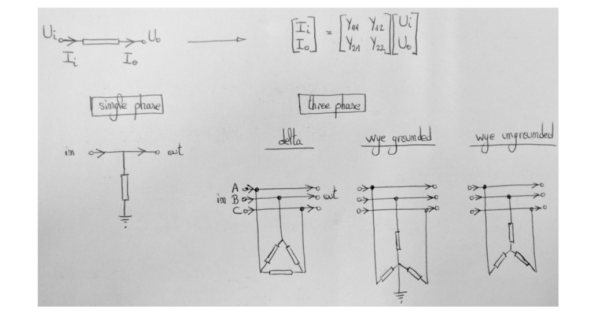

**Figure 25:** Single and three-phase connections

- Single phase:

$$\mathbf{Y} = -Y_{11}$$

- Three-phase delta:

$$\mathbf{Y} = \begin{bmatrix} Y_{12} - Y_{11} & -Y_{12} & Y_{11} \\ Y_{11} & Y_{12} - Y_{11} & -Y_{12} \\ -Y_{12} & Y_{11} & Y_{12} - Y_{11} \end{bmatrix}$$

- Three-phase wye grounded:

$$\mathbf{Y} = \begin{bmatrix} -Y_{11} & 0 & 0 \\ 0 & -Y_{11} & 0 \\ 0 & 0 & -Y_{11} \end{bmatrix}$$

- Three-phase wye ungrounded:

$$\mathbf{Y} = \frac{1}{3}Y_{11} \begin{bmatrix} -2 & 1 & 1 \\ 1 & -2 & 1 \\ 1 & 1 & -2 \end{bmatrix}$$

## Operating-point initialization

As the ABCD formulation is a linear representation of the power system, nonlinear descriptions of the components such as power converters must be linearized around an operating point. This operating point is determined in the initialisation by solving the power flow equations representing the combined AC/DC system.

The operating point is obtained from a combined AC/DC optimal-power-flow
formulation [Ergun2019](@cite). Its network models build on PowerModelsACDC
[ErgunGethVanHertem2018](@cite), MatACDC [Beerten2012](@cite), and the MATPOWER
AC formulation [ZimmermanMurillo2016](@cite).

For this calculation, the system is partitioned into AC and DC buses and branches,
coupled by converter models and supplemented by generators, loads, shunts, and
storage elements. Each frequency-domain component is mapped to a compatible
steady-state equivalent for the power-flow equations.

### AC and DC branches

AC and DC branches represent three-phase AC and DC connections between buses respectively. Branches are grouped inside AC or DC grids (zones). AC branches are defined with parameters described in [ZimmermanMurillo2016](@cite), while DC branches parameters are given in [Beerten2012](@cite).

The AC branch model [ZimmermanMurillo2016](@cite) is depicted in Fig. 26. The
combined AC/DC formulation also permits a shunt conductance, giving the branch
shunt admittance $\frac{g_c}{2} + j\frac{b_c}{2}$
[ErgunGethVanHertem2018](@cite). The complete branch-admittance matrix is

$$\mathbf{Y}_{ac} = \begin{bmatrix} (y_s + \frac{g_c}{2} + j\frac{b_c}{2}) \frac{1}{\tau^2} & -\frac{y_s}{\tau \exp(-j\theta_{shift})} \\ -\frac{y_s}{\tau \exp(j\theta_{shift})} & (y_s + \frac{g_c}{2} + j\frac{b_c}{2}) \end{bmatrix}.$$

The power-flow model treats the AC network as balanced. Each component therefore has a diagonal matrix model with identical diagonal entries.

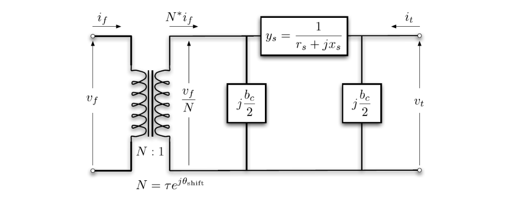

**Figure 26:** Matpower AC branch model [ZimmermanMurillo2016](@cite).

A DC branch is modeled with its equivalent series resistance [Beerten2012](@cite). For the power flow calculation, some components are modeled as AC and DC branches and their models are described in detail in this subsection.

#### Impedance

An impedance is represented by the ABCD relation

$$\begin{bmatrix} \mathbf{A} & \mathbf{B} \\ \mathbf{C} & \mathbf{D} \end{bmatrix} = \begin{bmatrix} \mathbf{I} & \mathbf{Z} \\ \mathbf{0} & \mathbf{I} \end{bmatrix}.$$

In the case of the DC impedance, all matrices are of size  $1 \times 1$ , while three-phase impedances are of size  $3 \times 3$ .

The DC branch model is then given as a Thevenin equivalent series impedance  $r = \Re\{\mathbf{Z}\}$ . The AC branch is modeled as an ideal transformer with  $\tau = 1$  and  $\theta_{\text{shift}} = 0$ , and with  $r_s = \Re\{\mathbf{Z}(j\omega) \langle 1, 1 \rangle\}$ ,  $x_s = \Im\{\mathbf{Z}(j\omega) \langle 1, 1 \rangle\}$ ,  $g_c = 0$  and  $b_c = 0$ .

This branch treatment applies only to impedances that connect distinct network nodes. AC shunt impedances are modeled as shunt components, while DC shunt impedances are modeled as DC loads.

#### Transformer

Because the detailed transformer model does not map directly to the branch model
in Fig. 26, its $\mathbf{Y}$ parameters are first extracted from the ABCD matrix
using the conversion given under [Transformation between $\mathbf{Y}$ and ABCD
parameters](@ref).

In the case of DC branches, since ABCD parameters are each of size  $1 \times 1$  (i.e. scalars), the tap value can be determined as  $\tau = \sqrt{\frac{A}{D}}$ , while the series impedance is obtained as  $r = \Re\{\frac{B}{\tau}\}$ .

In the case of AC networks and three-phase transformers, using the assumption of a balanced system, the submatrices  $\mathbf{Y} \langle 1 : 3, 1 : 3 \rangle$ ,  $\mathbf{Y} \langle 1 : 3, 4 : 6 \rangle$ ,  $\mathbf{Y} \langle 4 : 6, 1 : 3 \rangle$  and  $\mathbf{Y} \langle 4 : 6, 4 : 6 \rangle$  are diagonal. Thus, it is sufficient to use a single diagonal value from each submatrix. Then,  $\mathbf{Y} \langle 1, 1 \rangle = (y_s + \frac{g_c}{2} + j\frac{b_c}{2}) \frac{1}{\tau^2}$ ,  $\mathbf{Y} \langle 1, 4 \rangle = \mathbf{Y} \langle 4, 1 \rangle = -\frac{y_s}{\tau \exp(-j\theta_{\text{shift}})}$  and  $\mathbf{Y} \langle 4, 4 \rangle = (y_s + \frac{g_c}{2} + j\frac{b_c}{2})$ . The following expressions are derived:

$$\begin{aligned} \tau &= \sqrt{\frac{\mathbf{Y} \langle 4, 4 \rangle}{\mathbf{Y} \langle 1, 1 \rangle}}, \quad \theta_{\text{shift}} = 0, \\ y_s &= -\mathbf{Y} \langle 1, 4 \rangle \tau \exp(-j\theta_{\text{shift}}), \\ y_c &= \mathbf{Y} \langle 4, 4 \rangle - y_s, \\ r_s &= \Re\left\{\frac{1}{y_s}\right\}, \quad x_s = \Im\left\{\frac{1}{y_s}\right\}, \\ g_c &= \Re\{y_c\}, \quad b_c = \Im\{y_c\}. \end{aligned}$$

#### Transmission line

A transmission line (OHL, cable, cross-bonded cable or mixed OHL-cable) is represented using its nominal  $\pi$ -model depicted in Fig. 27, where

$$\begin{aligned} \mathbf{Z}(j\omega) &= \mathbf{Y}_c^{-1} \sinh(\mathbf{\Gamma}l), \\ \mathbf{Y}(j\omega) &= \mathbf{Y}_c \tanh(\mathbf{\Gamma}l). \end{aligned}$$

For the DC case, the shunt admittance is not considered, while the branch resistance is equal to  $r = \Re\{\mathbf{Z}(0)\}$ .

For the balanced AC transmission line, the impedance and admittance matrices are diagonal. It can be chosen as  $\mathbf{Z}(j\omega) = \mathbf{Z}(j\omega) \langle 1, 1 \rangle$  and  $\mathbf{Y}(j\omega) = \mathbf{Y} \langle 1, 1 \rangle$ . Then, the AC branch model is given by:

$$\begin{aligned} \tau &= 0, \quad \theta_{\text{shift}} = 0, \\ r_s &= \Re\{\mathbf{Z}(j\omega)\}, \quad x_s = \Im\{\mathbf{Z}(j\omega)\}, \\ g_c &= \Re\{\mathbf{Y}(j\omega)\}, \quad b_c = \Im\{\mathbf{Y}(j\omega)\}. \end{aligned}$$

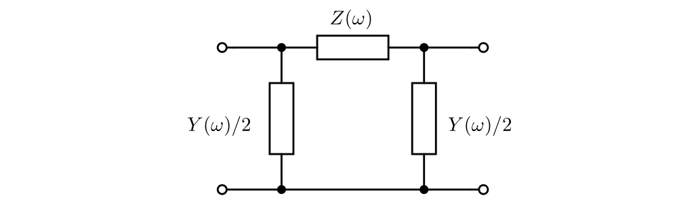

**Figure 27:** Nominal  $\pi$ -model of the transmission line.

### Shunt components

Shunt reactors and capacitors are defined with their admittance value as  $y = g_s + jb_s$  [ZimmermanMurillo2016](@cite).

### Generators

For operating-point initialization, an ideal three-phase AC source is represented
as a reference bus.

### Power converter

A power converter may be represented together with its phase reactor, filter, and
transformer [Beerten2012](@cite). The operating-point equivalent used here retains
the phase reactor associated with the MMC model.

Converter losses have the form $P_{loss} = a + bI_c + cI_c^2$. With ideal
semiconductor switches, the retained loss coefficient is
$c = \frac{R_{arm}}{2}$.

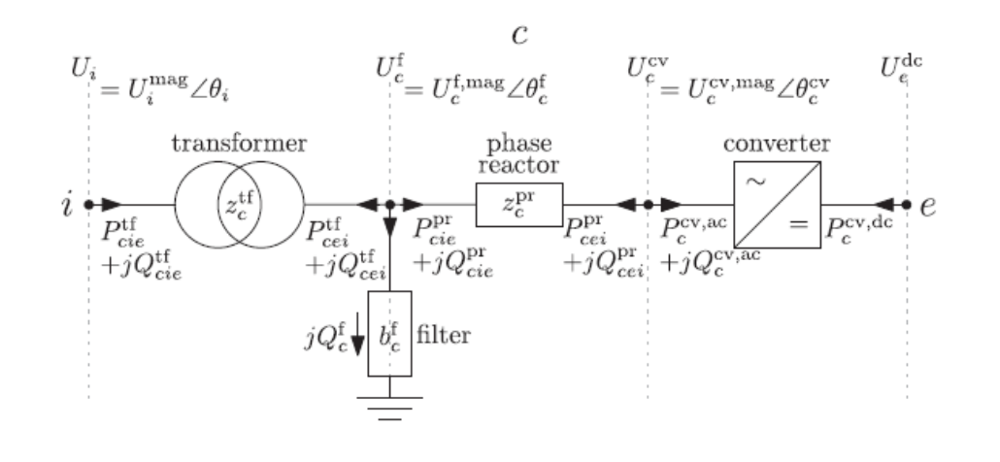

**Figure 28:** Power flow model of the power converter.

Depending on the actual realisation of the converter's controls, the parameters of the converter can be set as a DC voltage controlling or an active power controlling converter.
