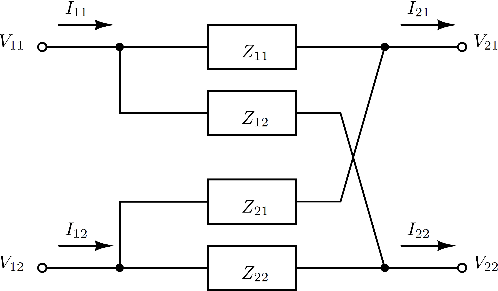

```@meta
CurrentModule = PowerImpedanceACDC
```

# Impedance and stability analysis

PowerImpedanceACDC exposes scalar analysis methods and more-specific Gridspace
methods. Existing scalar calls retain their historical arguments and return
types. Parametric calls return ordered case collections with coordinates,
statistics, optional numeric samples, and replay provenance.

## Harmonic impedance

`determine_impedance` assembles the network admittance over a frequency range,
eliminates the requested internal nodes or elements, and returns the selected
driving-point or transfer impedances. The underlying modified nodal formulation
follows the standard circuit-network construction [HoRuehliBrennan1975](@cite).



For a Gridspace input, the result is a `ParametricImpedance`. Each
`ImpedanceCase` records the deterministic coordinates, effective trial count,
case seed, sampling distribution, angular frequencies, mean response,
statistics, and optional complete trial tensor.

```julia
study = determine_impedance(
    builder_space;
    nets = [:bus],
    freq_range = (1.0, 5e3, 400),
    trials = 1000,
    distribution = :normal,
    seed = 2026,
    return_samples = true,
)

case = only(study)
case.impedance
case.statistics
case.samples
```

Statistics contain mean, sample standard deviation, minimum, 5th percentile,
median, 95th percentile, maximum, and sample count. Complex responses report
real and imaginary statistics separately.

## Nodal admittance and loop gain

The staged small-signal API keeps the network partition explicit:

```julia
Ynode, node_schema, omega = make_y_node(builder_space; freq_range = (1.0, 1e3, 400))
Yedge, _, _ = make_y_edge(builder_space; nodelist = node_schema,
    freq_range = (1.0, 1e3, 400))
loopgain = inv.(Yedge) .* Ynode
```

The specialized broadcast evaluates the inverse and product independently at
each frequency and numeric trial. It never applies nonlinear matrix operations
to aggregated mean-plus-standard-deviation matrices. `make_loopgain` provides
the equivalent fused path and reuses one sampled builder and linearization per
trial.

## Stability tools

The downstream tools accept scalar responses, parametric frequency responses,
and supported uncertain response containers:

- `nyquistplot` performs matched MIMO eigenlocus and encirclement analysis;
- `bodeplot` reports magnitude and phase responses;
- `small_gain` evaluates maximum singular-value conditions;
- `passivity` evaluates the implemented passivity index;
- `EVD` analyzes modal trajectories and participation information;
- `stabilitymargin` extracts gain, phase, and vector margins; and
- `unstable_frequency` reports detected unstable-frequency regions.

Parametric plotting calls return `ParametricStability`. Every `StabilityCase`
retains its analysis kind, tool-specific output, statistics, optional samples,
and constructed plot objects. Nyquist conclusions retain the generalized
criterion's standalone-subsystem-stability qualification; absent open-loop
right-half-plane pole information, they are not an unconditional proof of
absolute stability.

See [Parametric and uncertainty studies](gridspace.md) for trial pairing,
external empirical response adapters, uncertainty provenance, and exact replay.
