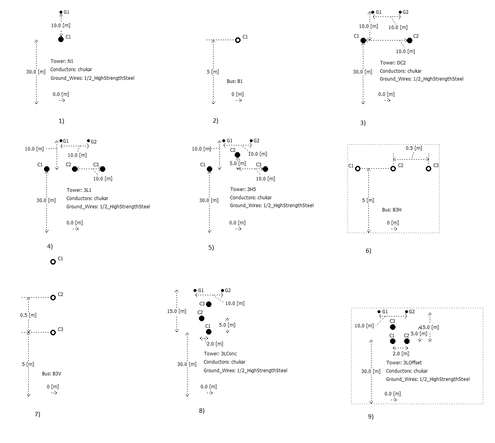
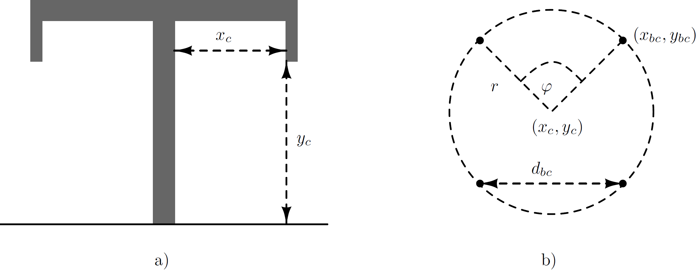
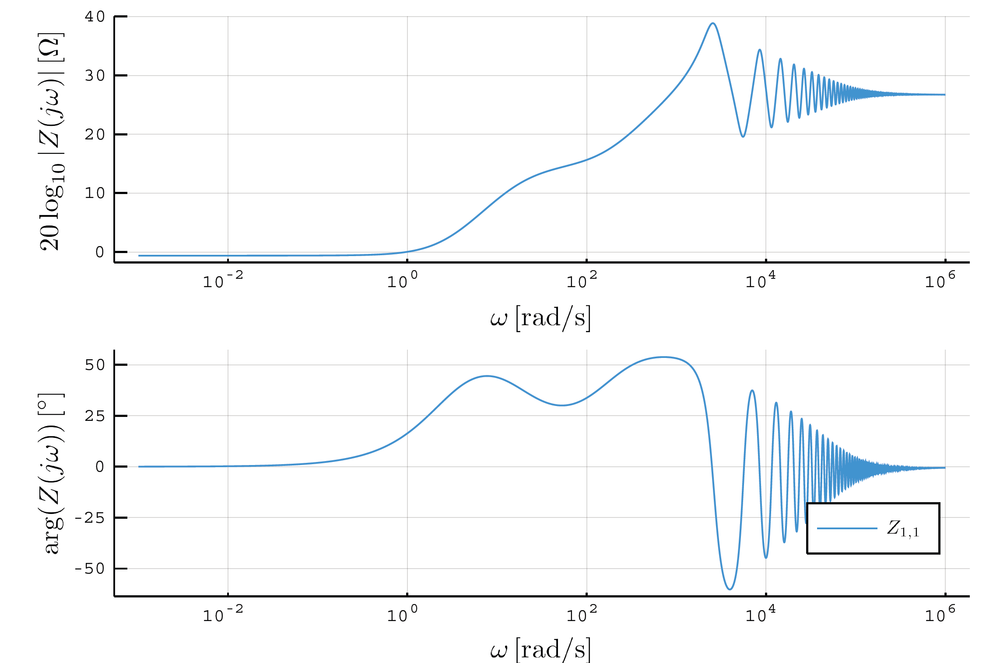

```@meta
CurrentModule = PowerImpedance
```

# Transmission lines and cables

PowerImpedance evaluates overhead-line and cable series impedance
``\mathbf{Z}(f)`` and shunt admittance ``\mathbf{Y}(f)`` in phase coordinates,
then forms the distributed-parameter transmission-line ABCD model
[CastellanosMarti1997, MorchedGustavsenTartibi1999](@cite):

```math
\begin{bmatrix}
\mathbf{A} & \mathbf{B} \\
\mathbf{C} & \mathbf{D}
\end{bmatrix}
=
\begin{bmatrix}
\cosh(\mathbf{\Gamma}l) &
\mathbf{Y}_c^{-1}\sinh(\mathbf{\Gamma}l) \\
\mathbf{Y}_c\sinh(\mathbf{\Gamma}l) &
\cosh(\mathbf{\Gamma}l)
\end{bmatrix},
```

where ``\mathbf{\Gamma}=\sqrt{\mathbf{Z}\mathbf{Y}}``,
``\mathbf{Y}_c=\mathbf{Z}^{-1}\mathbf{\Gamma}``, and ``l`` is the line
length.

## Overhead lines

An overhead-line model combines phase conductors, optional ground wires, and
an earth-return model. Conductors may be arranged in flat, vertical, delta,
offset, or concentric organizations, or supplied through explicit positions.
Bundle geometry, sag correction, conductor resistance and radius, ground-wire
data, and earth properties determine the full self and mutual parameter
matrices [MartinezVelasco2017](@cite).





The complete matrices are retained through the line evaluation; valid mutual
coupling is not discarded. Three-phase transformed models apply the requested
coordinate transformation only at the component boundary.

## Underground cables

A cable group contains coaxial conducting and insulating layers at specified
burial positions. The implemented native geometry supports core, sheath, and
armor/screen arrangements, layer material properties, and earth-return mutual
coupling. Internal grounded layers can be eliminated by Kron reduction to
obtain a compact terminal model [Ametani1980, RivasMarti2002](@cite).



## LineCableModels interoperability

LineCableModels interoperability is temporarily dormant while
LineCableModels.jl awaits registration. Native line constructors remain
available; the compatibility extension and its tests will be restored once
LineCableModels can be declared as a registered weak dependency.

See [`overhead_line`](@ref), [`cable`](@ref), [`Conductors`](@ref),
[`Groundwires`](@ref), [`Conductor`](@ref), and [`Insulator`](@ref) for the
current native constructors.
